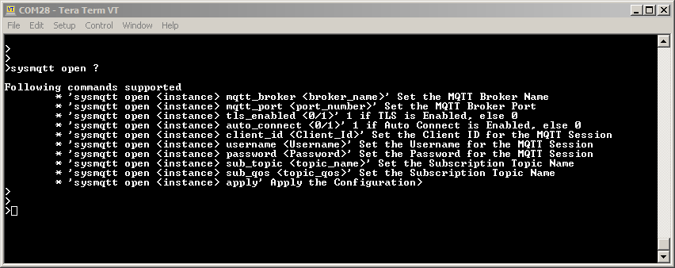
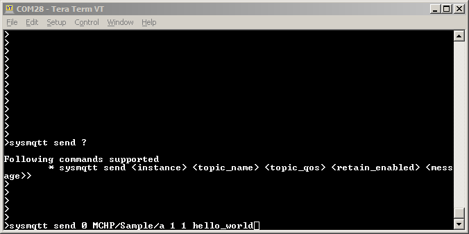
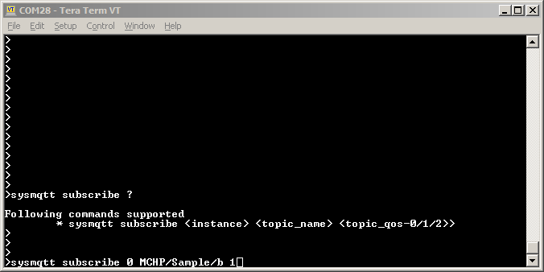
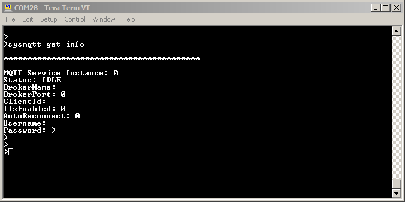
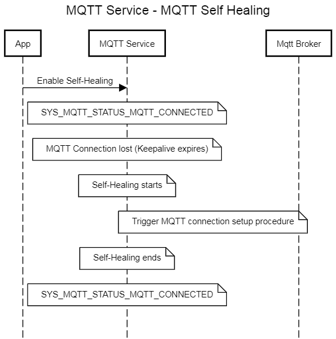

# MQTT System Service Usage

**Parent topic:**[MQTT System Service](GUID-6D4A7590-A5FE-418D-8A39-4F13DF7618BD.md)

## Description

The MQTT System Service provides simple APIs to enable MQTT Client Connectivity to a configured MQTT Broker. The User need not take care of intermediate states of a MQTT Connection, as the Service internally takes care of that. User is not required to have Security domain knowledge to establish a secured connection via the application using MQTT System Service library.

### Command Line

User can follow below commands for MQTT System Service:

1.sysmqtthelp MQTT System Service help command which displays the supported CLI commands

2.sysmqtt openCommand for Reconfiguring an already open instance of MQTT System Service

Note: Once the User has configured all the params, the last command for opening the new connection should 'sysmqtt open \[/topic/topic/topic/body/p/instance \{"- topic/instance "\}\) apply'\(instance\]

3.sysmqtt closeCommand to close the instance of MQTT System Service

4.sysmqtt sendCommand to send message on a topic for the instance of MQTT System Service

5.sysmqtt sunbscribeCommand to subscribe to a topic to receive message coming on that topic

6.sysmqtt unsunbscribeCommand to unsubscribe from a topic

7.sysmqtt get infoCommand for knowing the Current Information for all the Instances of Net System Service

#### Abstraction Model

The MQTT System Service library provides an abstraction to the MQTT APIs to provide following functionalities.

-   Connectivity for MQTT Client

-   Secured Connectivity using TLS

-   Self Healing

-   Reduce code user has to write

-   Reduce time to develop and maintain

The following diagram depicts the MQTT System Service abstraction model.

##### How The Library Works

By default MHC generated code provides all the functionalities to enable MQTT Client applicatation, with secured or unsecured connectivity. User needs to configure the required MQTT Brokerconfiguration using MHC. User needs to call the SYS\_MQTT\_Connect\(\) API with a valid callback to open an instance of the MQTT Client configured in the MHC.

The User Application is expected to call SYS\_MQTT\_Task\(\) API periodically as this API ensures that the MQTT System service is able to execute its state machine to process any messages and invoke the user callback for any events.

The User Application can call SYS\_MQTT\_Publish\(\)/ SYS\_MQTT\_Subscribe\(\) API in case it wants to publish message to a topic or receive messages on a topic.

The User Application when enables Auto-Reconnect, it enables the self healing feature of the MQTT Service. When this feature is enabled, the service will automatically try to establish connection with the MQTT Broker whenever a connection breaks.

