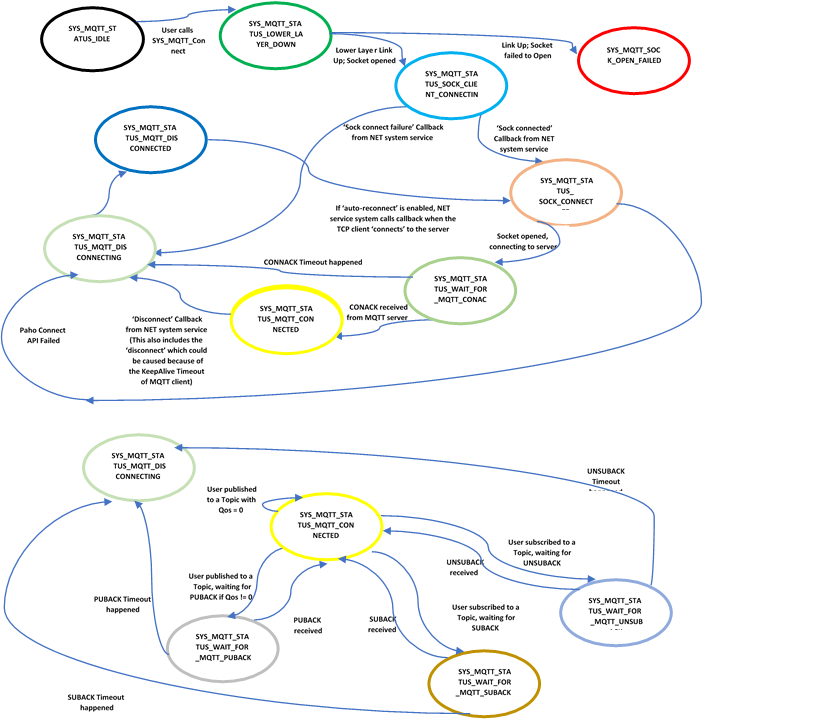
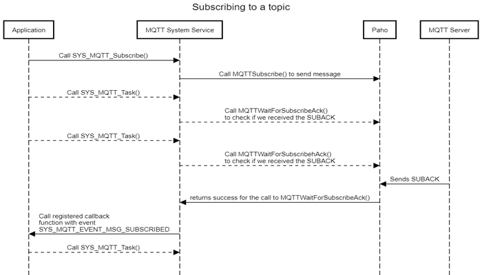

# MQTT System Service Developer's Guide

The purpose of this document is to explain the MQTT system service design to enable the developer to make changes in the service code as per his/ her requirements if the need be.

**Parent topic:**[MQTT System Service](GUID-6D4A7590-A5FE-418D-8A39-4F13DF7618BD.md)

# Overview

MQTT system service Library provides an application programming interface \(API\) to manage MQTT Protocol functionalities. The MQTT system service uses the third party software Paho APIs for achieving these functionalities. It supports key features like client mode for MQTT connectivity, TLS for MQTT connection, Self-Healing, etc.

Though the application developer is free to use the third party software directly to manage the MQTT functionalities, the use of MQTT system service eases the work of the developer by reducing the state machine that the application needs to maintain while also reducing the amount of bookkeeping that otherwise is needed.

# Detailed Design

MQTT system service is a background service that runs in the context of the application task. The idea of the MQTT system service is to reduce the code size for the application and simplifying the state machine that the application may need to maintain by abstracting out the complexity in the system service. The system service achieves this by maintaining a state machine of its own and any bookkeeping that may be needed.

The MQTT system service supports only client mode. Also, the service supports secured connections for its MQTT connection with the server.

The MQTT system service also supports Self-Healing, or ‘Auto-Reconnect’. In case there is an interruption in the connection due to the underlying lower layer or when the peer disconnects, the service tries to reconnect again without making the application to bother about retriggering the connection.

## State Machine

The various states of the MQTT system service are of the enum type **SYS\_MQTT\_STATUS**. The application is expected to call **SYS\_MQTT\_Task\(\)** periodically from its own task context. This function ensures that the MQTT system service state machine receives sufficient execution cycles to process pending packets in the network stack.

### MQTT Client State Machine

The MQTT system service runs a finite state machine with the following states:

1.  *SYS\_MQTT\_STATUS\_IDLE*: Initial State of the MQTT system service, at the initialization.

2.  *SYS\_MQTT\_STATUS\_LOWER\_LAYER\_DOWN*:

    1.  State the MQTT system service enters after initialization.

    2.  In this state, the MQTT system service opens the TCP socket using NET system service without bothering if the lower layer is UP or DOWN. This offloads the application’s burden to poll the link before communicating over the network.

3.  *SYS\_MQTT\_STATUS\_SOCK\_CLIENT\_CONNECTING*: In this state, the service opens a socket to connect to the MQTT server using NET system service, and waits for the connection to get established.

4.  *SYS\_MQTT\_STATUS\_SOCK\_CONNECTED*: TCP connection between the client the MQTT server established; client triggers MQTT ‘Connect’ to the server via the Paho APIs.

5.  *SYS\_MQTT\_STATUS\_SOCK\_OPEN\_FAILED*: Opening the Socket failed. Failure is conveyed to the application via the **callback** registered with the service.

6.  *SYS\_MQTT\_STATUS\_MQTT\_CONNECTED*: Client connected to the MQTT server; Connection status is conveyed to the application via the registered callback. In this state, the service is waiting to receive data on topic\(s\).

7.  *SYS\_MQTT\_STATUS\_MQTT\_DISCONNECTING*: Client comes into this state whenever there is either of the following:

    1.  A failure to connect to the server \(tcp or mqtt connection\), or

    2.  Timeout occurs on not receiving expected response, or

    3.  Failure in case of publishing a message or subscribing to a topic. In this state, the client reinitializes the data w.r.t subscriptions topics.

    4.  Paho API to connect to MQTT server failed.

8.  *SYS\_MQTT\_STATUS\_MQTT\_DISCONNECTED*: Client disconnected from the server. ‘Disconnection’ is conveyed to the application via the registered callback.

9.  *SYS\_MQTT\_STATUS\_WAIT\_FOR\_MQTT\_CONACK*: Client waits for the reply ‘CONACK’ from the MQTT server in response to his ‘CONNECT’ message, for SYS\_MQTT\_PERIOIDC\_TIMEOUT seconds.

10. *SYS\_MQTT\_STATUS\_WAIT\_FOR\_MQTT\_SUBACK*: Client waits for the reply ‘SUBACK’ from the MQTT server in response to his ‘SUBSCRIBE’ message, for SYS\_MQTT\_PERIOIDC\_TIMEOUT seconds.

11. *SYS\_MQTT\_STATUS\_WAIT\_FOR\_MQTT\_PUBACK*: Client waits for the reply ‘PUBACK’ from the MQTT server in response to his ‘PUBLISH’ message in case it was sent with Qos as 1 or 2, for SYS\_MQTT\_PERIOIDC\_TIMEOUT seconds.

12. *SYS\_MQTT\_STATUS\_WAIT\_FOR\_MQTT\_UNSUBACK*: Client waits for the reply ‘UNSUBACK’ from the MQTT server in response to his ‘UNSUBSCRIBE’ message, for SYS\_MQTT\_PERIOIDC\_TIMEOUT seconds.

The above state machine has been implemented in the function *SYS\_MQTT\_Paho\_Task\(\).* The statme machine figure has been broken into two, so as to make it simpler to understand, and hence both the above state machine figures should be seen in conjection.

**In case the user wants to add or remove a state or modify the action to be done in an existing state \(for instance, adding a timer for a time-bound result\), one would need to modify the function *SYS\_MQTT\_Paho\_Task\(\)* along with the enum *SYS\_MQTT\_STATUS*.**

## Number of Subscription Topics Supported

The number of subscription topics supported by MQTT system service currently is 2. \*\*The same can be increased by changing the value of the macro \*SYS\_MQTT\_SUB\_MAX\_TOPICS. \*\*\*Also note, that the underlying third party software Paho supports 5 subscription topics, so if the developer needs to use more than 5 topics, he/ she will need to make changes in the Paho code \(*MAX\_MESSAGE\_HANDLERS*\) too.

## Timeperiod for ACK

The number of seconds the MQTT system service will wait for the ACK to come – CONACK, or SUBACK, or PUBACK, or UNSUBACK is currently 5 seconds. The developer can increase or decrease this time by modifying the value of SYS\_MQTT\_PERIOIDC\_TIMEOUT.

## External APIs

### SYS\_MQTT\_Connect \(\)

Description: The API is used for connecting an MQTT client to the server. The user needs to register a callback function via this API. The registered callback lets the user know the operational status change or when data is received on the topic subscribed to. One of the advantages of this API is that the user can call this API without bothering about the operational state of the underlying layers, and the service shall take care of all the complexity in such cases.

### SYS\_MQTT\_Disconnect \(\)

Description: The API is used for disconnecting the MQTT client from the server.

### SYS\_MQTT\_Publish \(\)

Description: The API is used for publishing a message onto a topic.

### SYS\_MQTT\_Subscribe \(\)

Description: The API is used for subscribing to a topic.

### SYS\_MQTT\_Unsubscribe \(\)

Description: The API is used for unsubscribing from a topic.

### Handling of the messages received for a Topic

### Handling of KeepAlive messages after the MQTT connection is UP

### SYS\_MQTT\_Task \(\)

Description: This API is used for smooth functioning of the state machine of the MQTT system service\*\*.\*\* The application needs to call this API periodically. Also, this API takes as parameter the handle returned when we connect to server via the SYS\_MQTT\_Connect\(\) call.

### SYS\_MQTT\_Initialize \(\)/ SYS\_MQTT\_Deinitialize \(\)

Description: These functions are used for initializing/ deinitializing the data structures of the MQTT system service. The SYS\_MQTT\_Initialize\(\) function is called from within the System Task. **Users can modify these functions in case they want to take some additional actions during the initialization of the service.**

## CLI Commands

The details of the cli commands supported by MQTT system service can be found under **MQTT System Service Usage**.The CLI commands are implemented using the function *SysMqtt\_Command\_Process\(\)*. **The users can modify any of the commands – configuration or get as per their needs by modifying the above function.**

## Code location

The base code for the MQTT system service can be found in the *wireless\_system\_pic32mzw1\_wfi32e01\\system\\mqtt*

The same shall be copied to the following location after the code for the application is generated – *my\_application\\firmware\\src\\config\\pic32mz\_w1\_curiosity\\system\\mqtt*

The code has 4 files:

1.  Header file: *sys\_mqtt.h* and *sys\_paho\_mqtt.h*

2.  Source file: *src/sys\_mqtt.c* and *src/sys\_paho\_mqtt.c*

Since the above files could see modifications across releases, hence the users would need to take care of merging the changes they did in these files with the ones which were done in the new release by Microchip Team. For this the user needs to take care of this while generating the code via the MHC:

While generating the code the user should use the Merge Strategy as “USER\_ALL”, and press “Generate”. In case there are changes done by user in any of the files, the MHC shall prompt the user about it:

The user can merge his changes with the the latest changes done in the services using the above window.

## Reference

|S. No|Name|
|-----|----|
|1|MQTT system service Usage|
|2|MQTT system service Interface|
|3|NET system service Interface|

