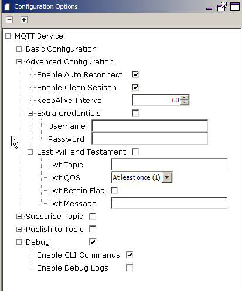

# MQTT System Service Configuration

The MQTT System Service library should be configured through the MHC. When user selects the MQTT System Service library, all the required dependencies components are added automatically in the MHC configuration.

The following figure shows the MHC configuration window for configuring the MQTT System Service and a brief description of various configuration options.

-   Open the MHC 3

-   Drag the MQTT Service Module into the Active components from the Available components

-   Configure the various parameters of Basic Configuration

|Parameter Name|Default Value|Description|
|--------------|-------------|-----------|
|Broker Name||Name of the MQTT BrokerNote: User should ensure that the Broker is UP and running. In case the connection timesout often, the User can modify the value of SYS\_MQTT\_PERIOIDC\_TIMEOUT as per his requirement.|
|Server Port||Port number of the MQTT Broker at which the MQTT Client should connect|
|Enable TLS|FALSE|If TRUE, the MQTT connection should use TLS while connecting to the broker. If FALSE, the MQTT connection should not use TLS.Note: In case the TLS is enabled, the User needs to update the component 'Presentation Layer' with the CA Certificate format, location, name, and size. Other parameters can be updated as per the User's requirements.|
|Enable SNI|FALSE|Server Name Indication ff TRUE, enables a client device to specify the domain name it is trying to reach in the first step of the TLS handshake.Note: In case the SNI is enabled, the Broker Name is taken as the Domain Name.|
|Enable ALPN|FALSE|Application-Layer Protocol Negotiation \(ALPN\) is a TLS extension that allows the application layer to negotiate which protocol should be performed over a secure connection in a manner that avoids additional round trips and which is independent of the application-layer protocols|
|Client Id||MQTT Client Id should be unique for the Broker. If left empty, the Id will be generated randomly|
|Network Interface||Network Interface - Wifi or Ethernet on which the MQTT Client should run. On choosing Ethernet, the MHC will add EthMAC, MIIM, and LAM8740 Components. The User needs to attach the EthMAC to the NetConfig \(in System Component Window\) via the MAC parameter in Instance 1|

-   Configure the various parameters of Presentation Layer if TLS enabled

-   Configure the various parameters of 'Advanced Configuration' of the MQTT Service

|Parameter Name|Default Value|Description|
|--------------|-------------|-----------|
|Enable Auto Reconnect|TRUE|If TRUE, the MQTT Service will auto reconnect to the Broker if connection is broken. If FALSE, the customer application needs to take care of triggering the connection process again.|
|Enable Clean Session|TRUE|If TRUE, the MQTT Client shall tell the Broker that the session is clean; else, it will let the Broker know that the session is a continuation of the previous session. Also, if “clean session” is disabled, it is valid only within a single boot session in the Client \(i.e. reconnecting before the next power-on reset\) and not across boots|
|KeepAlive Interval|60 sec|If no data flows over an open connection for a certain KeepAliveInterval then the client will generate a PINGREQ and expect to receive a PINGRESP from the broker. This message exchange confirms that the connection is open and working|
|Username/ Password|Disabled|In case the connection to Broker needs a Username and Password|
|Last Will and testament|Disabled|LWT Configuration has the following parameters – 1. Topic, 2. QoS, 3. Retain, and 4. Message This ‘Message’ will be sent on the ‘Topic’ whenever the Broker finds that there is an ungraceful disconnection with the Client.|

-   Configure the remaining parameters

|Parameter Name|Default Value|Description|
|--------------|-------------|-----------|
|Subscription Topic|Disabled|Subscription configuration has 2 Parameters – 1. Topic and 2. Qos. \(0 \(Atmost Once\), 1 \(Atleast Once\), 2 \(Exactly Once\)\) The User can configure these parameters to subscribe to a Topic to receive messages.|
|Publish to Topic|Disabled|Publishing a message to Topic has 3 Parameters – 1. Topic and 2. Qos \( 0 \(Atmost Once\), 1 \(Atleast Once\), 2 \(Exactly Once\)\) 3. Retain: If the Broker should retain the message The User can configure these parameters to and use them along with the message to send it on a particular Topic.|
|Enable CLI Commands|Enabled|Enabling this flag compiles in the CLI commands related to Mqtt Service. The user can use these CLI commands to connect/ disconnect, subscribe/ unsusbscribe, publish messages onto a topic.|
|Enable Debug Logs|Disabled|Enabling this flag compiles in debug logs and user can enable them at runtime. The user can use the following CLI commands to enable/ disable levels and flows for the MQTT service: 1. sysmqtt debug level \[/topic/body/table/tgroup/tbody/row/entry/value \{"- topic/value "\}\) 2. sysmqtt debug flow \[/topic/body/table/tgroup/tbody/row/entry/value/value \{"- topic/value "\}\) Note: In case the user enables debug logs, user needs to manually add the 'App Debug Service' component from Wireless-\> System Service-\> App Debug Service.\(value\]\(value\]|

**Parent topic:**[MQTT System Service](GUID-6D4A7590-A5FE-418D-8A39-4F13DF7618BD.md)

