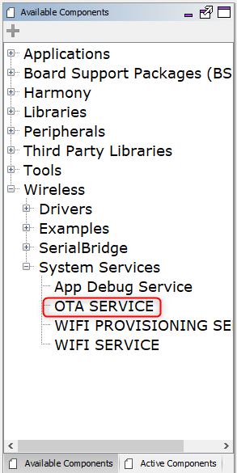
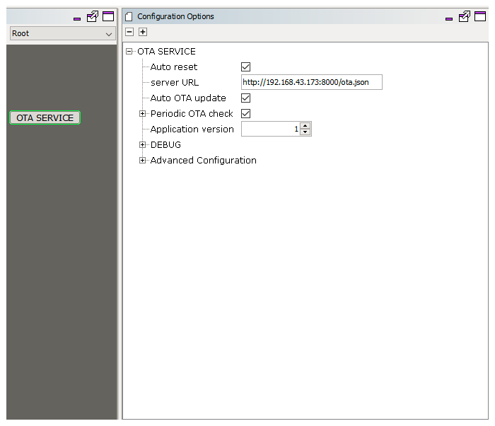
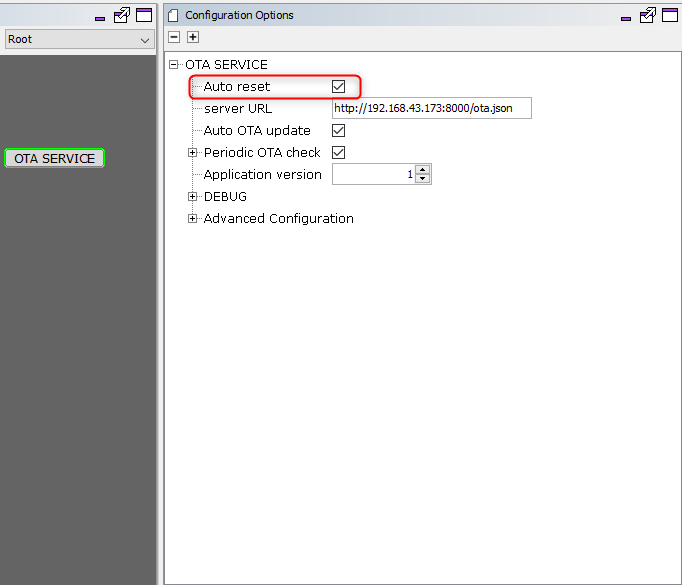
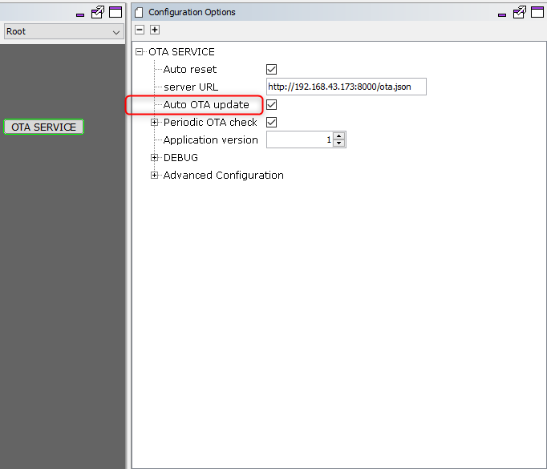
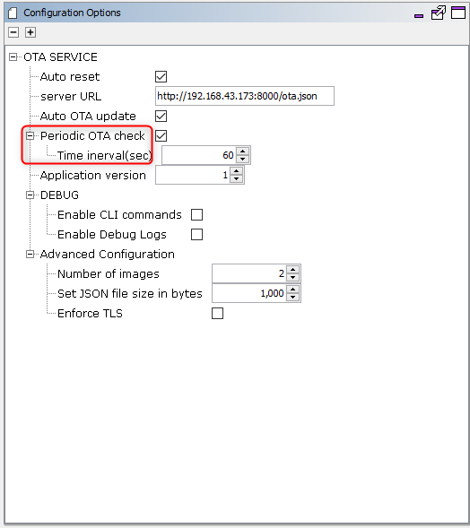
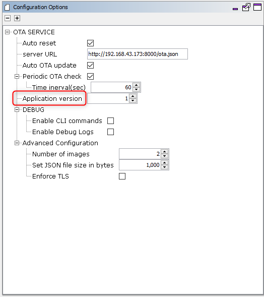
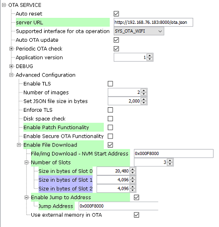
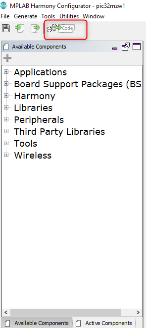

# OTA System Service Configuration  

The OTA System Service library should be configured through the MHC ( ***MHC configuration is initial configuration, some of parameters can be changed runtime using respective APIs - follow OTA System Service Interface*** ). When user selects the OTA System Service library, all the required dependencies components are added automatically in the MHC configuration.

The following figure shows the MHC configuration window for configuring the OTA System Service and a brief description of various configuration options.  

1.Open the MHC 3  

2.Drag the OTA Service Module into the Active components from the Available components.

3.Configure the various parameters  

4.configure **Auto reset**:  

  

   By default this option will be enabled . System will reset automatically after successful download of OTA image to load new image into the system and run, without any notifications to the current application.  

   If it is disabled by user , system will not go for reset automatically. Instead, it will be waiting for user trigger for system reset.  

5.configure **server URL**:

User need to provide the server url where the manifest file in `json` format is available.  
OTA service will use this url to connect to server and download `json` file to check for updates.  

6.configure **supported Interface**:

User can select the preferred interface for the OTA operation.OTA can be performed either over Wi-Fi interface or over Ethernet interface. By default, Wi-Fi interface will be selected. If the user select to have the Ethernet interface for the OTA operation, then the required components for enabling the Ethernet interface will be added to the configuration automatically. The user need to ensure that the added ETHMAC gets connected to the netConfig MAC instance(System Configuration) as shown in the below image.  

  

7.configure **Auto OTA update**:

  

By default this option will be enabled.  

   If it is enabled , OTA service will not wait for user trigger to initiate OTA process. It will automatically start OTA process if new update is available in the server.  

   If it is disabled , OTA service will wait for user trigger to initiate OTA process. User will be notified about new update availability via user defined callbacks.  

8.configure **Periodic OTA check**:  

  

   By default this option will be configured to 60 seconds.  

   When enabled, OTA service will periodically download the manifest file to check for update availability at the user defined interval.  

   If it is disabled, OTA service will be checking for update availability on user trigger via the control message API.  

9.configure **Application version**:

     

   User must ensure to provide correct integer version while generating OTA image.  

   This version number should be also be mentioned in the manifest file in OTA server. OTA upgrade will be triggered when a version with numerically higher version number is identified in the manifest file.  

10.configure **Advanced Configuration**:  

  

   - **Number of images:**  This configuration controlled the number of OTA images to be stored in the filesystem. If number of images downloaded via OTA process exceeds this number, user will be notified with a console message and the oldest image in the database will be replaced with newly downloaded image automatically. This count excludes the factory reset image that will be backed-up to the filesystem by the bootloader at first boot.
   
   - **Set JSON file size in bytes:** Maximum size (in bytes) of the `json` file present in the server.
   - **Enable TLS:** By default this option will be disabled.
   If it is enabled by user, service will support TLS connection.Based on the server URL prefix (`http://` / `https://`)mentioned by user, the system will try to download the manifest file. Server certificate verification will not be done fo TLS connection, if required user needs to explicitly add lines of code for same.

   - **Enforce TLS:** By default this option will be disabled.
   If it is enabled by user, service will enforce TLS connection irrespective of the server URL prefix (`http://` / `https://`)mentioned by user. Server certificate verification will not be done fo TLS connection, if required user needs to explicitly add lines of code for same.

   **NOTE : If disabled service will automatically detect and go for http or https connection, by looking into server URL mentioned by user**

   - **Disk space check:** By default this option will be disabled. If enable, free sector check will be done, in ext flash before download starts.

   -  **Enable Patch Functionality:** By default this option will be disabled. If enabled by user ,OTA service will enable code to support `patch` functionality.

   -  **Enable Secure OTA Functionality:** By default this option will be disabled. If enabled by user ,OTA service will enable code to support `Secure OTA` functionality.

   - **Enable File Download :** By default this option will be disabled. The user can download any file or image into internal flash memory by enabling this option.

      - **File/img Download - NVM Start Address :** This parameter specifies the Program flash start address where the downloaded files/images should be stored. The default value is 0x000F8000. Based on the project size user has to adjust this address value with not overlapping with code area.

      - **Number of Slots :** : This defines the number of slots to be created in the Program flash memory. By default this **Number of Slots** is set to 1. Maximum number of slots which can be configured is 3.

      - **Size in bytes of Slot X :** These variables store the size of each slot in Program flash. The number of slot size variables generated depends on the Number of Slots mentioned. The default size is 4096 and the size of each slot can be in-between 4096 and 20480.

         Design Guideline : if customer wants to include multiple files into a single slot, then user has to make a unified file by including multiple files and parse those files accordingly into OTA service.

      - **Enable Jump Address :** This enables the application to jump to this address after all the files are downloaded. This is only applicable if the user is downloading file as an image. User should enable the macro `SYS_OTA_FILE_JUMP_ENABLE` in the Bootloader project, `ota_booloader_wolfcrypt`.Also, user should update the jump address of the new image `APP_IMG_BOOT_ADDR_2` in the `ota_config.h` file of Bootloader project `ota_booloader_wolfcrypt`.

         **Note** : This feature has very high dependency on the available memory on the device. Enabling the feature is strictly constrained to the memory availability. 

      - **Use External Memory on OTA :**  The option decides, if OTA feature will be using External Memory along with File System. The user can disable the usage of File System if required. Currently, this feature will be available only with the bootloader `ota_booloader_wolfcrypt`. The user should undefine the macro `SYS_OTA_FS_ENABLED` in Bootloader project also. The Patch update feature will not be supported without File System. By default, `Use External Memory on OTA` feature will be enabled in both application and bootloader.

   

**All of the required files are automatically added into the MPLAB X IDE project by the MHC when the OTA Service is selected for use.**

11.Generate code using "Generate" button in MHC :

12.In case you are creating a factory image, include the bootloader project from the apps folder of this repo as a `loadable project` into the application :

  

   **NOTE: Please open bootloader project in MPLABx IDE and compile separately, before loading**  

13.Build the project to get the unified hex and load the same on device.

## Building custom logic

User can build custom logic required for own design, using configrable parameters as mentioned above. Additionally , users can also build and apply required application level logic which can be included in **app.c** file.  

## Easily registering user callbacks

For making it more flexible and easy for users to register OTA service callbacks, OTA service will generate the  **app_ota.c** file, which contains a skeleton of the callback function definition that can be used to implement business-logic. The file also provides an easy to use initialization function that can be invoked from the user application to register these callbacks in case you decide to use them. For more details please follow the instructions in **OTA System Service Interface** section.  

