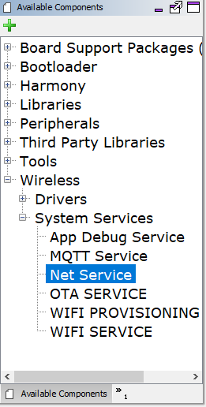
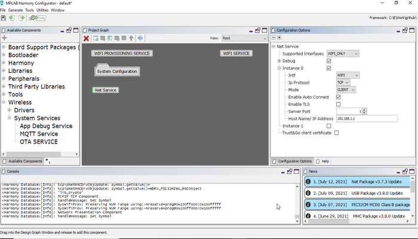
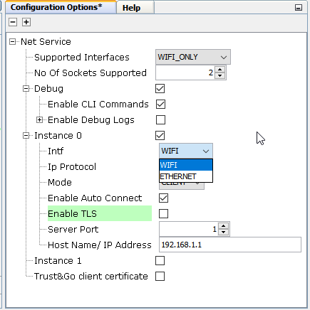
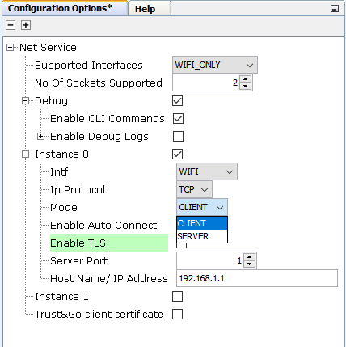
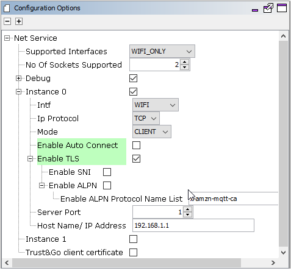

# Net System Service Configuration

The NET System Service library should be configured through the MHC. When user selects the NET System Service library, all the required dependencies components are added automatically in the MHC configuration. In the NET System Service library, user can select the mode as Client or Server and make required changes for the selected mode.

The following figure shows the MHC configuration window for configuring the NET System Service and a brief description of various configuration options.

1.  Open the MHC 3

2.  Drag the Net Service Module into the Active components from the Available components

    

3.  Configure the various parameters

    

4.  Configure the Supported Interface - 'WIFI\_ONLY' \(Wifi Only\), or 'WIFI\_ETHERNET' \(Wifi and Ethernet Both\) or 'ETHERNET\_ONLY \(Ethernet Only\)'. On choosing WIFI\_ETHERNET or ETHERNET\_ONLY, the MHC will add EthMAC, MIIM, and LAM8740 Components.

    

    The User needs to attach the EthMAC to the NetConfig \(in System Component Window\) via the MAC parameter in Instance 1 like below:

    

5.  Configure the Number of Sockets Supported - 2 to 8, default sockets being 2.

    

6.  Debug - Enabled by default - has 'CLI Commands' and 'Debug Logs' as sub parameters

    

    a. Enable CLI Commands - This is enabled by default. This can be used by the user to give commands on the CLI to open/ close/ send message on a socket. b. Enable Debug Logs in case more prints are required for debugging. By Default, the parameter value is 'False'. Note: In case the user enables debug logs, user needs to manually add the 'App Debug Service' component from Wireless-\> System Service-\> App Debug Service.

7.  User can configure 2 instances of a Net Socket. By default, only the first one is enabled.

8.  Instance 0:

    1.  Configure the Network Interface as Wifi or Ethernet. Note that Ethernet as an interface can only be chosen if the 'Supported Intefaces' parameter is WIFI\_ETHERNET.

        

    2.  Configure the IP Protocol as either TCP or UDP

        

    3.  Configure the Mode as either Client or Server

        

    4.  Enable/ Disable "Auto Connect" as per your requirement. This parameter when enabled ensures that if the NET Connection disconnects, the service internally tries to reconnect. By Default, the parameter value is 'True'.

    5.  Enable/ Disable "Enable TLS" in case the connection needs to be secured. This parameter is valid only in case of 'Client' mode. Please note that in case this parameter is Enabled, users need to configure the WolfSSL related configuration on their own. Also, this parameter is valid only for TCP Connections. By Default, the parameter value is 'False'.Note: In case the TLS is enabled, the User needs to update the component 'Presentation Layer' with the CA Certificate format, location, name, and size. Other parameters can be updated as per the User's requirements.

        -   "Enable SNI" - Server Name Indication if TRUE, enables a client device to specify the domain name it is trying to reach in the first step of the TLS handshake. By Default, the parameter value is 'False'.Note: In case the SNI is enabled, the Server Name is taken as the Domain Name.

        -   "Enable ALPN" - Application-Layer Protocol Negotiation \(ALPN\) is a TLS extension that allows the application layer to negotiate which protocol should be performed over a secure connection in a manner that avoids additional round trips and which is independent of the application-layer protocols. By Default, the parameter value is 'False'.

            

        -   Configure the various parameters of Presentation Layer if TLS enabled

            

    6.  Server Port - 1-65535. This is a mandatory parameter. In case Mode is selected as Client, Server port should be set to the port number of the server with which the device will connect. In case mode is selected as Server, Server port should be set to the port number at which the server will start

    7.  Host Name/ IP Address: Can be a Host Name or an IP Address. By Default, the parameter value is '192.168.1.1'.

9.  Instance 1 - User can enable this to give a configuration for another socket. Also, once the user gives this config, SYS\_NET\_Open\(\) API will return error if it is passed NULL as config since now more than one instance is defined in the MHC.

10. To use the device certificates stored in [ATECC608A-TNGTLS](https://www.microchip.com/wwwproducts/en/ATECC608A-TNGTLS), enable the "Trust&Go client certificate" option under the net configurations.

    

All of the required files are automatically added into the MPLAB X IDE project by the MHC when the Net Service is selected for use.

**Parent topic:**[Net System Service](GUID-F15AF9B8-740F-41C4-BFC2-850D793F858B.md)

