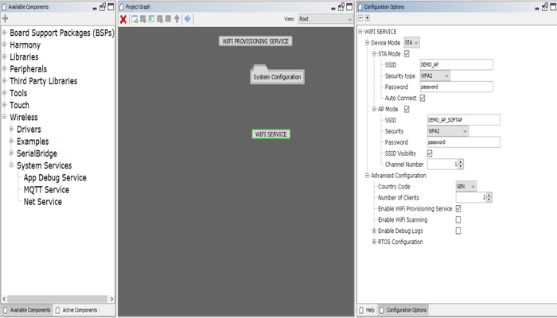

# Wi-Fi System Service Configuration

The Wi-Fi System Service library should be configured through MHC\(MPLAB Harmony Configurator\). The following figure shows the MHC configuration window for configuring the Wi-Fi System Service and a brief description of various configuration options.

When user select the Wi-Fi System Service library, all the required dependencies are added automatically into the MHC configuration. In the Wi-Fi System Service library, user can select the operating device mode as station\(STA\) or access point\(AP\) and make a required changes in the selected mode.



**Parent topic:**[Wi-Fi System Service](GUID-6EA44F54-91D8-42F6-A226-793CA7D06695.md)

## Configuration Options:

Using MHC menu,user can select required device mode as a station\(STA\) or access point\(AP\).

### Device Mode:

```
Indicates the device operation mode(STA/AP).
```

### STA Mode:

```
SSID: 
    Access Point (AP/Router) SSID to connect.

Security type :
    Indicates the security being used by the AP with which device should connect - OPEN / WPA2 / WPAWPA2 (Mixed)/ WPA3.    

Password:
    Password to be used while connecting to the AP. 
    This is mandatory if security mode is set to anything other than OPEN. 
    It will be ignored if security mode is set to OPEN.

Auto Connect:
    Indicate whether to auto connect to AP (enable) or wait for user input (disable).
```

### AP Mode:

```
SSID:
    Indicate AP mode SSID.

Security:
    Indicate AP mode security: 
        - OPEN
        - WPA2
        - WPAWPA2(Mixed)
        - WPA3
        
Password:
    Indicate AP mode password(passphrase).

SSID Visibility:
    Indicate AP mode SSID visibility.

Channel:
    Indicate operating channel of AP mode.
```

### Advanced configuration:

```
Country code:
  Regulatory domain country code configuration:
    - GEN - General
    - USA - North America
    - EMEA - Europe
    - JPN - Japan

Number of Clients:
    Indicates the maximum number of clients user can register.

Enable Wi-Fi Provisioning service:
    Enables/Disables Wi-Fi Provisioning System Service  functionality along with Wi-Fi System Service.

Enable Wi-Fi Scanning:
    Enables/Disables Wi-Fi Scan functionality of Wi-Fi System Service.
    
    Channel Number:
       Values of Scan Channel Number:  
       0 - scan all the channels
       1 to 13 - - scan on specified channel

    Scan Mode:
      ACTIVE  : Requst Active Scan
      PASSIVE : Request Passive Scan

    SSID List(Active Scan Only):
      User preferred SSIDs list for scanning.
      Maximum 4 SSIDs of maximum 32 characters allowed. 
        e.g. DEMO_AP1,DEMO_AP2,DEMO_AP3,DEMO_AP4).
      This field is only applicable for Active Scan.

    SSID List Delimiter character:
      Delimiter used for separating names in the "SSID List(Active Scan Only)" field.

    Bitwise Channel Scan Mask:
      - 0x3fff : All 2.4GHZ channels
      - 0x07ff : 2.4GHz channels 1 through 11 (USA)
      - 0x1fff : 2.4GHz channels 1 through 13 (Europe)
      - 0x3fff : 2.4GHz channels 1 through 14(Asia)
      - 0x0001 : 2.4GHz (2412 MHz) channel 1
      - 0x0002 : 2.4GHz (2412 MHz) channel 2
      - User can find more details of mask value in the   WDRV_PIC32MZW_CHANNEL24_MASK

    Number Of Slots:
      The number of scan slots per channel.
      
    Active Slot Time:
      Time(in milliseconds) spent on each active channel to send the probe requests to find near by BSS's.
    
    Passive Slot Time:
      Time(in milliseconds) spent on each passive channel listening for beacons.
        
    Number Of Probes:
      Number of probe requests to be sent for each scan slot when "SSID List" field is empty.
      Number of probe requests to be sent for each ssid to scan in each scan slot when preferred "SSID List" is configured.
      This field is only applicable for Active Scan.

    Scan Match Mode:
      FIND_ALL: Scan for all matches
      STOP_ON_FIRST : Stop scan on first match

Enable Debug Logs:
    Enables/Disables Wi-Fi and Wi-Fi Provisioning System Service flows and levels.
    Note: In case the user enables debug logs, user needs to manually add the 'App Debug Service' component from Wireless-> System Service-> App Debug Service.
```

### Enabling Wi-Fi System Service

All of the required files are automatically added into the MPLAB X IDE<br />project by the MHC when the library is selected for use.

