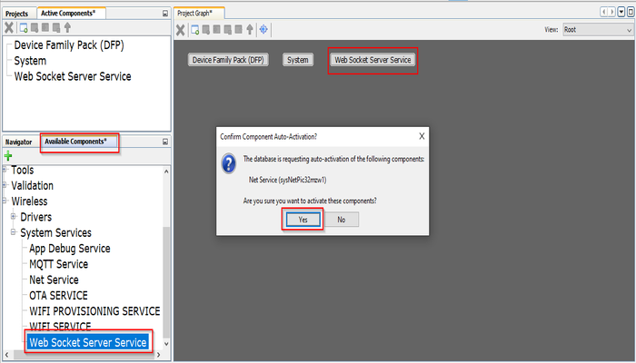
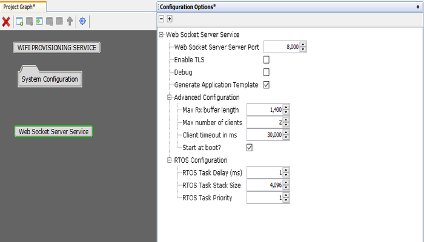
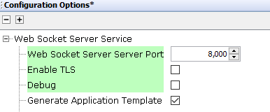
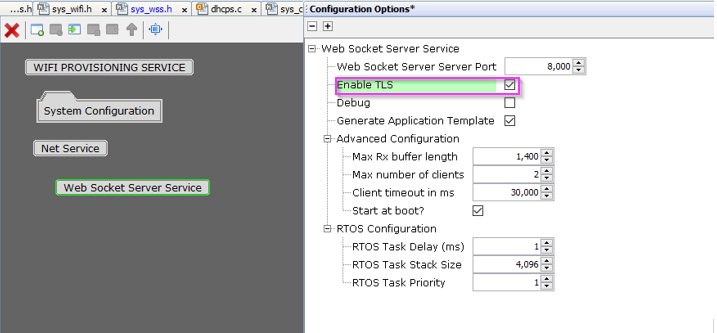
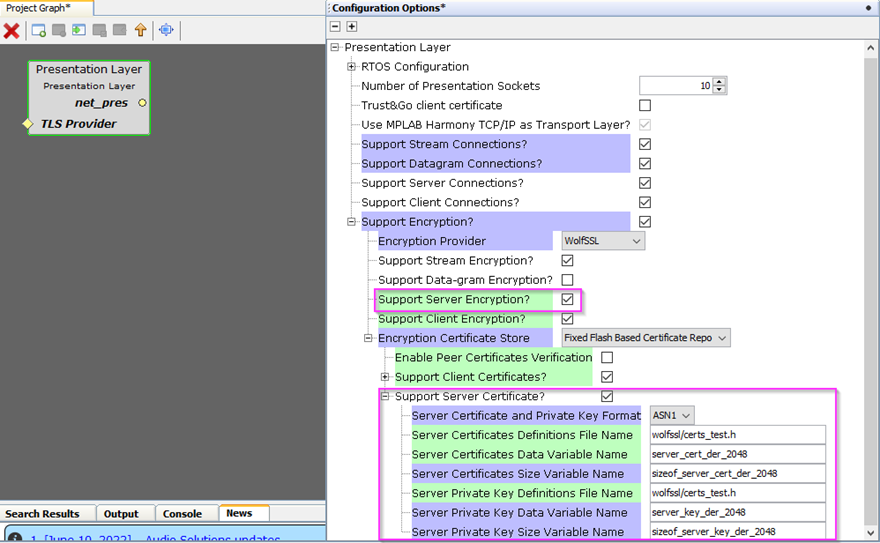

# Web Socket Server \(WSS\) System Service Configuration

The WSS System Service library should be configured through MHC. When user adds the WSS System Service into a project, all the required dependencies and components are added automatically into the the projects MHC configuration. The user can make changes according to the application requirement in the WSS System Service configuration menu.

The following figure shows the MHC configuration window for configuring the WSS System Service and a brief description of various configuration options.

1.Open the MHC 32.Drag the WSS Service Module into from the Available components into the Project Graph. This will trigger the auto activation of the dependent modules.Click on 'Yes' in the confirmation window popped up for component auto activation.



3.Configure the various parameters



|Parameter|Description|
|---------|-----------|
|Port|port used by the WSS service. Default is 8000|
|Debug|Control debug prints. Disabled by default|
|Secure Socket|Enable/Disable secure web socket. Make sure that you configure the required server certificate and keys in the underlying layers.|
|Application template Generation|Control the generation of an application template with all the available callbacks.|



4.Enabling secure websocket<br />To enable the secure web socket support user need to enable the below configuration options.

```
1.Enable the highlighted option in the Web Socket Server Service MHC configuration.
```



```
2.Enable the highlighted options in the Presentation layer net_pres component. The server certificate used by default will be the one provided by the wolfssl module. The user need to provide the required modifications in the highlighted parameters incase of application specific certificate and keys.
```



5.Advanced Configuration with RX buffer size, maximum number of supported clients, client timeout and start at boot features.

|Parameter|Description|
|---------|-----------|
|Max Rx buffer length|Max length of the buffer used to receive and process messages. Default is 1400|
|Max number of clients|Max number of clients allowed to connect to teh WSS. Default is 2|
|Client timeout in ms|Timeout after which the client is disconnected in case of no data transfer or ping after connection. Default is 30000|
|Start at boot|Control when the WSS is enabled. Enabled at boot by default.|


6.FreeRTOS configuration enabled by default

|Parameter|Description|
|---------|-----------|
|RTOS Task Delay\(ms\)|WSS RTOS task delay. Default is 1 ms|
|RTOS Task Stack Size|WSS RTOS task stack size. Default is 4096|
|RTOS Task priority|WSS RTOS task priority. Default is 1|

All of the required files are automatically genarted and added into the MPLAB X IDE project by the MHC when the code generation<br />completes successfully.

**Parent topic:**[Web Socket Server \(WSS\) System Service](GUID-097A4209-8474-480E-A141-6C8FC60A7671.md)

