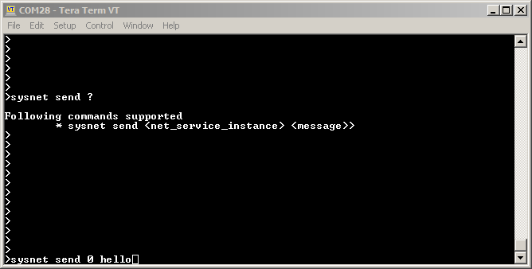

# Net System Service Usage

**Parent topic:**[Net System Service](GUID-F15AF9B8-740F-41C4-BFC2-850D793F858B.md)

## Description

The NET System Service provides simple APIs to enable Server or Client Connectivity for either TCP or UDP. The User need not take care of intermediate states of a TCPIP Connection, as the Service internally takes care of that. User is not required to have Security domain knowledge to establish a secured connection via the application using NET System Service library.

### Command Line:

User can follow below commands for NET System Service:

1.  sysnethelp

    NET System Service help command which displays the supported CLI commands

    

2.  sysnet open

    Command for Reconfiguring an already open instance of Net System Service

    

3.  sysnet close

    Command to close the instance of Net System Service

    

4.  sysnet send

    Command to send message on the network connection established by the instance of Net System Service

    

5.  sysnet get info

    Command for knowing the Current Information for all the Instances of Net System Service

    

## Abstraction Model

The NET System Service library provides an abstraction to the NetPres/ TCPIP APIs to provide following functionalities.

-   Connectivity for TCP Client

-   Connectivity for TCP Server

-   Connectivity for UDP Client

-   Connectivity for UDP Server

-   Self Healing

-   Reduce code user has to write

-   Reduce time to develop and maintain

The following diagram depicts the Net System Service abstraction model.

## How The Library Works

By default MHC generated code provides all the functionalities to enable Client or Server mode applicatation, with TCP or UDP as the IP Protocol. User needs to configure the required Client or Server mode configuration using MHC. User needs to call the SYS\_NET\_Open\(\) API with a valid callback to open an instance of the Client/ Server configured in the MHC.

The User Application is expected to call SYS\_NET\_Task\(\) API periodically as this API ensures that the Net System service is able to execute its state machine to process any messages and invoke the user callback for any events.

The User Application can call SYS\_NET\_CtrlMsg\(\) API in case it wants to disconnect the opened connection or to reconnect using different configuration.

