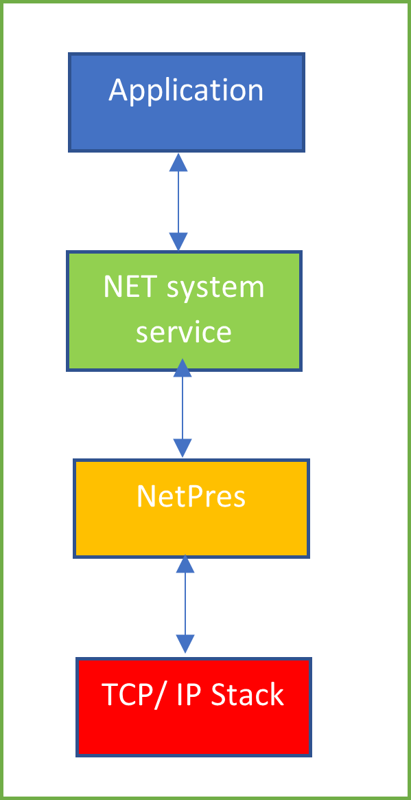
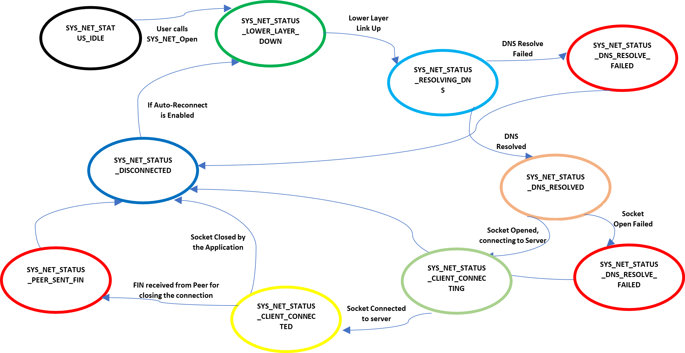
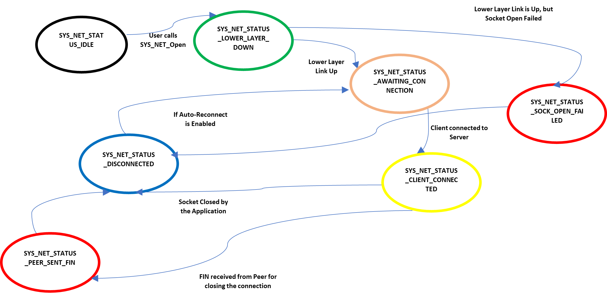
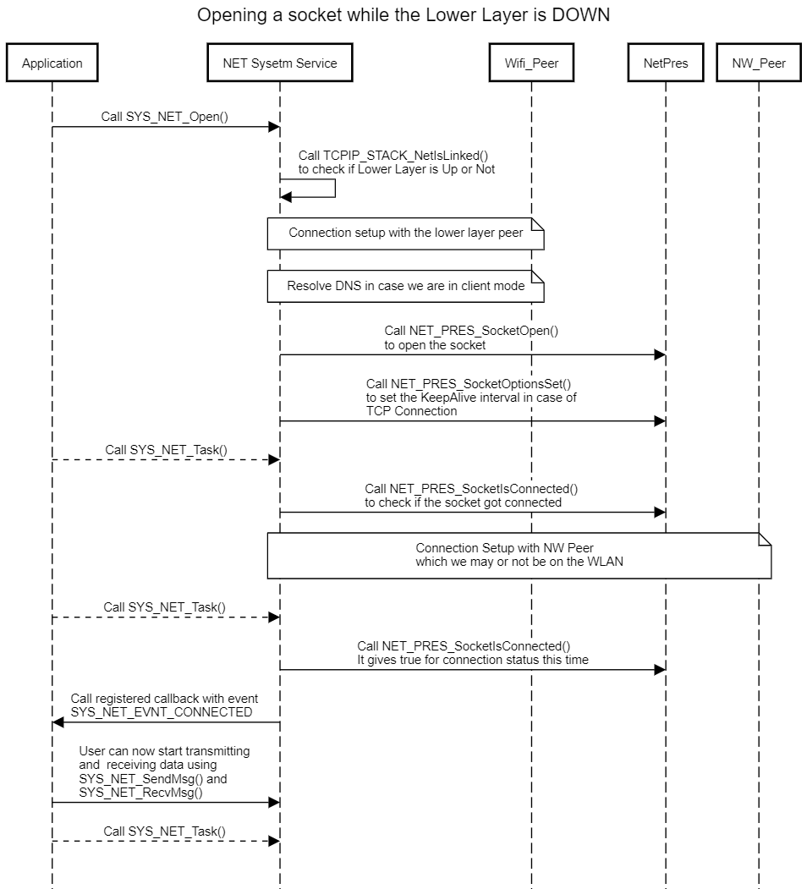
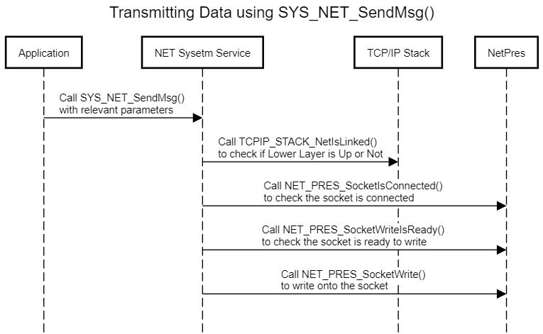
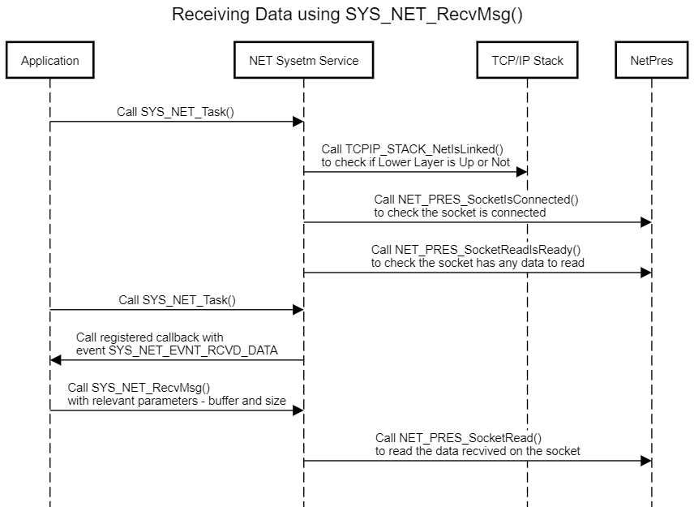
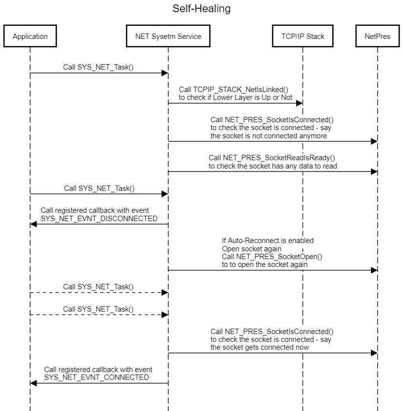
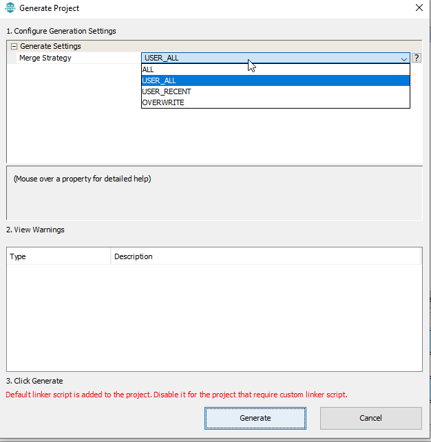
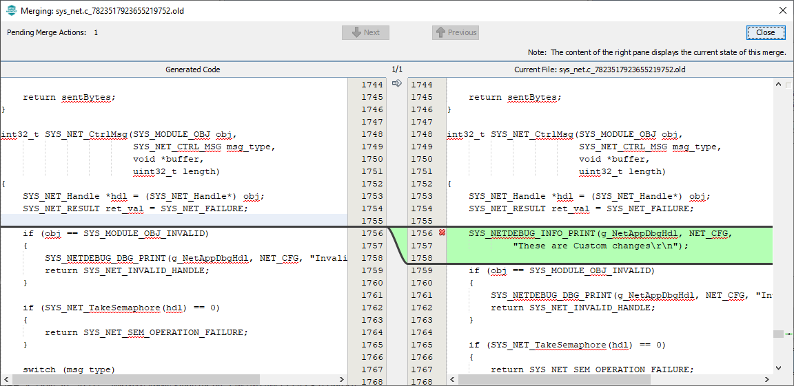

# Net System Service Developer's Guide
{: .no_toc }

### Table of contents
{: .no_toc .text-delta }

1. TOC
{:toc}

---
The purpose of this document is to explain the NET system service design to enable the developer to make changes in the service code as per his/ her requirements if the need be.

# Overview

NET system service Library provides an application programming interface (API) to manage TCP/IP Networking functionalities. The NET system service uses the MPLAB Harmony NetPres APIs for achieving these functionalities. It supports key features like Client/ Server Mode for IP Network Connectivity, TLS for TCP Connection, Self-Healing, etc.

Though the application developer is free to use the Harmony NetPres or TCP/ IP Stack APIs directly to manage the TCP/ IP Networking functionalities, the use of NET system service eases the work of the developer by reducing the state machine that the application needs to maintain while also reducing the amount of bookkeeping that otherwise is needed.

# Detailed Design

NET system service is a background service that runs in the context of the application task. The idea of the NET system service is to reduce the code size for the application and simplifying the state machine that the application may need to maintain by abstracting out the complexity in the system service. The system service achieves this by maintaining a state machine of its own and any bookkeeping that may be needed.

The NET system service supports two modes – [*CLIENT*](https://microchip-mplab-harmony.github.io/wireless_system_pic32mzw1_wfi32e01/system/net/docs/interface.html#sys_net_mode_client), and [*SERVER*](https://microchip-mplab-harmony.github.io/wireless_system_pic32mzw1_wfi32e01/system/net/docs/interface.html#sys_net_mode_server) for both the transport protocols – [*TCP*](https://microchip-mplab-harmony.github.io/wireless_system_pic32mzw1_wfi32e01/system/net/docs/interface.html#sys_net_ip_prot_tcp) and [*UDP*](https://microchip-mplab-harmony.github.io/wireless_system_pic32mzw1_wfi32e01/system/net/docs/interface.html#sys_net_ip_prot_udp). Also, the service supports secured connections for TCP.

The NET system service also supports Self-Healing, or ‘Auto-Reconnect’. In case there is an interruption in the connection due to the underlying lower layer or when the peer disconnects, the service tries to reconnect again without making the application to bother about retriggering the connection.

## State Machine 

The various states of the NET system service are of the enum type [*SYS_NET_STATUS*](https://microchip-mplab-harmony.github.io/wireless_system_pic32mzw1_wfi32e01/system/net/docs/interface.html#sys_net_status). The Client and Server have a separate state machine. The application is expected to call [*SYS_NET_Task()*](https://microchip-mplab-harmony.github.io/wireless_system_pic32mzw1_wfi32e01/system/net/docs/interface.html#sys_net_task) periodically from its own task context. This function ensures that the NET system service state machine receives sufficient execution cycles to process pending packets in the network stack.

### Client State Machine

The NET system service runs a finite state machine with the following states in the ‘CLIENT’ mode:

1.  *SYS_NET_STATUS_IDLE*: Initial State of the NET system service, at the initialization.

2.  *SYS_NET_STATUS_LOWER_LAYER_DOWN*:

    1.  State the NET system service enters after initialization.

    2.  In this state, the NET system service checks for the operational status of the lower layer – Wi-Fi or Ethernet. If the link is down, the service remains in this state.

    3.  Since this state monitors the link state, it offloads the application’s burden to poll the link before communicating over the network.

3.  *SYS_NET_STATUS_RESOLVING_DNS*: In this state, the service tries to resolve the server DNS to connect to it.

4.  *SYS_NET_STATUS_DNS_RESOLVED*: In this state, the service has resolved the DNS and opens a socket to connect to the server.

5.  *SYS_NET_STATUS_CLIENT_CONNECTING*: In this state, the service has resolved the DNS and opens a socket to connect to the server.

6.  *SYS_NET_STATUS_WAIT_FOR_SNTP*:

    1.  Valid for Secured TCP Connection only.

    2.  Service waits for the system to connect to the NTP server and get the time snapshot. This is required to validate the peer certificate.

7.  *SYS_NET_STATUS_TLS_NEGOTIATING*:

    1.  Valid for secured TCP connection only.

    2.  TLS negotiation is in progress.

8.  *SYS_NET_STATUS_TLS_NEGOTIATION_FAILED*:

    1.  Valid for secured TCP connection only.

    2.  TLS Negotiation failed. Failure conveyed to the application via the [callback](https://microchip-mplab-harmony.github.io/wireless_system_pic32mzw1_wfi32e01/system/net/docs/interface.html#sys_net_callback) registered with the service.

9.  *SYS_NET_STATUS_CONNECTED*: Client connected to the server; Connection status is conveyed to the application via the callback registered with the service. In this state, the service is waiting to receive data from the peer.

10. *SYS_NET_STATUS_SOCK_OPEN_FAILED*: Opening the Socket failed. Failure is conveyed to the application via the registered callback.

11. *SYS_NET_STATUS_DNS_RESOLVE_FAILED*: DNS for the server is not resolved because the DNS server is unavailable or due to misconfiguration w.r.t. server name. Failure is conveyed to the application via the registered callback.

12. *SYS_NET_STATUS_DISCONNECTED*: Client disconnected from the server. ‘Disconnection’ is conveyed to the application via the registered callback. If the application has enabled ‘Auto-Reconnect,’ the service shall switch to SYS_NET_STATUS_LOWER_LAYER_DOWN state and re-try to connect to the server.

13. *SYS_NET_STATUS_PEER_SENT_FIN*:

    1.  Valid for TCP Connection only

    2.  The client received SYN FIN from the peer, which is conveyed to the application via the registered callback.

14. *SYS_NET_STATUS_CONNECTED_LL_DOWN*: Lower layer went down while the client is connected to the server. This is conveyed to the application, but the service shall not take any action on this. The service expects the TCP/ IP Stack to take action as per the protocol standards. Since the application will be informed about this state, it is free to call NET system server API to disconnect the connection with the peer.

The above state machine has been implemented in the function *SYS_NET_Client_Task()*

### Server State Machine

The NET system service runs a finite state machine with the following states valid in ‘SERVER’ mode:

1.  SYS_NET_STATUS_IDLE: Initial State of the NET system service, at the initialization.

2.  SYS_NET_STATUS_LOWER_LAYER_DOWN:

    1.  State the NET system service enters after initialization.

    2.  In this state, the NET system service checks for the operational status of the lower layer – Wi-Fi or Ethernet. If the link is down, the service remains in this state.

    3.  The service shall open the socket if the lower layer link is Up.

3.  SYS_NET_STATUS_SERVER_AWAITING_CONNECTION: Service waits for a connection from a client

4.  SYS_NET_STATUS_WAIT_FOR_SNTP:

    1.  Valid for Secured TCP Connection only.

    2.  Service waits for the system to connect to the NTP server and get the time snapshot required to validate the peer certificate.

5.  SYS_NET_STATUS_TLS_NEGOTIATING:

    1.  Valid for Secured TCP Connection only.

    2.  TLS negotiation is in progress.

6.  SYS_NET_STATUS_TLS_NEGOTIATION_FAILED:

    1.  Valid for secured TCP connection only.

    2.  TLS negotiation failed. Failure is conveyed to the application via the [callback](https://microchip-mplab-harmony.github.io/wireless_system_pic32mzw1_wfi32e01/system/net/docs/interface.html#sys_net_callback) registered with the service.

7.  SYS_NET_STATUS_CONNECTED: Client connected to the server; Connection Status is conveyed to the application via the callback registered with the service. In this state, the service is waiting for data from the peer.

8.  SYS_NET_STATUS_SOCK_OPEN_FAILED: Opening the Socket failed. Failure conveyed to the application via the registered callback.

9.  SYS_NET_STATUS_DISCONNECTED: Client disconnected from the server. ‘Disconnection’ is conveyed to the application via the registered callback. If the application has enabled ‘Auto-Reconnect’, the service shall open the socket again and switch to SYS_NET_STATUS_SERVER_AWAITING_CONNECTION, waiting for the client to reconnect.

10. SYS_NET_STATUS_PEER_SENT_FIN:

    1.  Valid for TCP connection only

    2.  The client received SYN FIN from the peer, which is conveyed to the application via the registered callback.

11. SYS_NET_STATUS_CONNECTED_LL_DOWN: Lower Layer went down while the server is connected to the client. This is conveyed to the application, but the service shall not take any action on this. The service expects the TCP/ IP Stack to take action as per the protocol standards. Since the application will be informed about this state, it is free to call NET system server API to disconnect the connection with the peer.

The above state machine has been implemented in the function *SYS_NET_Server_Task()*

**In case the user wants to add or remove a state or modify the action to be done in an existing state (for instance, adding a timer for a time-bound result), one would need to modify the function *SYS_NET_Server_Task() or and SYS_NET_Client_Task()* along with the enum *[SYS_NET_STATUS](https://microchip-mplab-harmony.github.io/wireless_system_pic32mzw1_wfi32e01/system/net/docs/interface.html#sys_net_status).***

## Number of Sockets Supported

The number of sockets supported by NET system service currently is 2. **The same can be increased by changing the value of the macro [*SYS_NET_MAX_NUM_OF_SOCKETS*](https://microchip-mplab-harmony.github.io/wireless_system_pic32mzw1_wfi32e01/system/net/docs/interface.html#sys_net_max_num_of_sockets)**

## External APIs

### [SYS_NET_Open ()](https://microchip-mplab-harmony.github.io/wireless_system_pic32mzw1_wfi32e01/system/net/docs/interface.html#sys_net_open)

Description: The API is used for opening the socket for either TCP or UDP in Client or Server Mode. The user needs to register a callback function via this API. The registered callback lets the user know the operational status change or when data is received on the socket. One of the advantages of this API is that the user can open a socket without bothering about the operational state of the underlying layers, and the service shall take care of all the complexity in such cases.

### [SYS_NET_Close ()](https://microchip-mplab-harmony.github.io/wireless_system_pic32mzw1_wfi32e01/system/net/docs/interface.html#sys_net_close)

Description: This API is used for closing the socket connection with the peer.

### [SYS_NET_SendMsg ()](https://microchip-mplab-harmony.github.io/wireless_system_pic32mzw1_wfi32e01/system/net/docs/interface.html#sys_net_sendmsg)

Description: This API is used for transmitting the data to the peer on this socket connection.

### [SYS_NET_RecvMsg ()](https://microchip-mplab-harmony.github.io/wireless_system_pic32mzw1_wfi32e01/system/net/docs/interface.html#sys_net_recvmsg)

Description: This API is used for receiving data sent in by the peer on the socket connection.

### Self-Healing

Description: Self-Healing, or ‘Auto-Reconnect’ is a feature supported by NET system service where in case there is an interruption in the connection due to the underlying lower layer or when the peer disconnects, the service tries to reconnect again without making the application to bother about retriggering the connection

### SYS_NET_Task ()

Description: This API is used for smooth functioning of the state machine of the NET system service**.** The application needs to call this API periodically. Also, this API takes as parameter the handle returned when we open the socket via the SYS_NET_Open() call. So in case the user opens two sockets, he/ she will need to call SYS_NET_Task() perdiocially for each of the socket connections.

###  SYS_NET_CtrlMsg ()

Description: This API is used for Reconnecting or Disconnecting an existing connection. **The user can scale this API for triggering other actions if the need be. One of the parameters this API takes is the enum [SYS_NET_CTRL_MSG](https://microchip-mplab-harmony.github.io/wireless_system_pic32mzw1_wfi32e01/system/net/docs/interface.html#sys_net_ctrl_msg) which the user can expand to add on new message type and add a new case in the switch condition of this API to trigger the new action.**

### [SYS_NET_Initialize](https://microchip-mplab-harmony.github.io/wireless_system_pic32mzw1_wfi32e01/docs/system/net/docs/interface.html#sys_net_initialize)()/ [SYS_NET_Deinitialize()](https://microchip-mplab-harmony.github.io/wireless_system_pic32mzw1_wfi32e01/docs/system/net/docs/interface.html#sys_net_deinitialize)

Description: These functions are used for initializing/ deinitializing the data structures of the NET system service. The SYS_NET_Initialize() function is called from within the System Task. **Users can modify these functions in case they want to take some additional actions during the initialization of the service.**

### [SYS_NET_SetConfigParam()](https://microchip-mplab-harmony.github.io/wireless_system_pic32mzw1_wfi32e01/docs/system/net/docs/interface.html#sys_net_setconfigparam)

Description: The API is currently used for configuring the parameter – ‘auto_reconnect’ after the user has called SYS_NET_Open(). **The user can modify this API to add other configuration parameters which he/ she may want to change.** Please note that some of the configuration parameters will come into effect only after the socket reconnects.

## CLI Commands

The details of the cli commands supported by NET system service can be found [here](https://microchip-mplab-harmony.github.io/wireless_system_pic32mzw1_wfi32e01/docs/system/net/docs/usage.html). The CLI commands are implemented using the function *SysNet_Command_Process()*. **The users can modify any of the commands – configuration or get as per their needs by modifying the above function.**

## Code location

The base code for the NET system service can be found in the *wireless_system_pic32mzw1_wfi32e01\\system\\net*

The same shall be copied to the following location after the code for the application is generated – *my_application\\firmware\\src\\config\\pic32mz_w1_curiosity\\system\\net*

The code has 2 files:

1.  Header file: *sys_net.h*

2.  Source file: *src/sys_net.c*

> Since the above files could see modifications across releases, hence the users would need to take care of merging the changes they did in these files with the ones which were done in the new release by Microchip Team. For this the user needs to take care of this while generating the code via the MHC:
>

While generating the code the user should use the Merge Strategy as “USER_ALL”, and press “Generate”. In case there are changes done by user in any of the files, the MHC shall prompt the user about it:

The user can merge his changes with the the latest changes done in the services using the above window.

# Reference

| S. No | Name                         | Link                                                                                                               |
|-------|------------------------------|--------------------------------------------------------------------------------------------------------------------|
| 1     | NET system service Usage     | <https://microchip-mplab-harmony.github.io/wireless_system_pic32mzw1_wfi32e01/docs/system/net/docs/usage.html>     |
| 2     | NET system service Interface | <https://microchip-mplab-harmony.github.io/wireless_system_pic32mzw1_wfi32e01/docs/system/net/docs/interface.html> |
