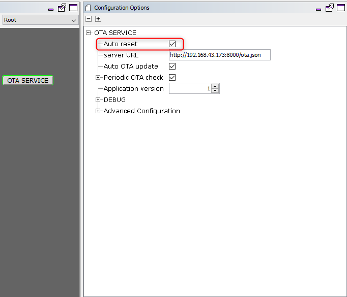
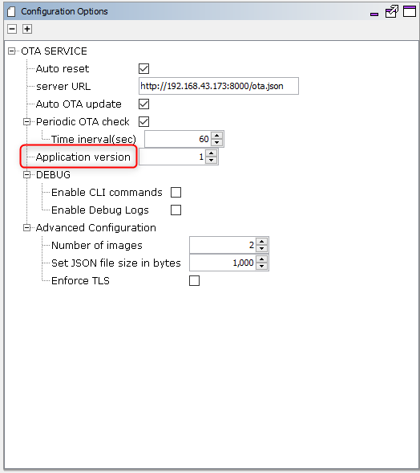
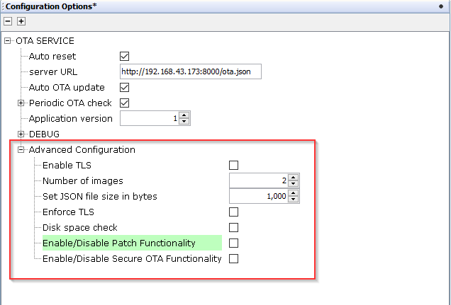

# OTA System Service Configuration

The OTA System Service library should be configured through the MHC \( ***MHC configuration is initial configuration, some of parameters can be changed runtime using respective APIs - follow OTA System Service Interface*** \). When user selects the OTA System Service library, all the required dependencies components are added automatically in the MHC configuration.

The following figure shows the MHC configuration window for configuring the OTA System Service and a brief description of various configuration options.

1.Open the MHC 3

2.Drag the OTA Service Module into the Active components from the Available components.

3.Configure the various parameters

4.configure **Auto reset**:

By default this option will be enabled . System will reset automatically after successful download of OTA image to load new image into the system and run, without any notifications to the current application.

If it is disabled by user , system will not go for reset automatically. Instead, it will be waiting for user trigger for system reset.

5.configure **server URL**:

User need to provide the server url where the manifest file in `json` format is available.OTA service will use this url to connect to server and download `json` file to check for updates.

6.configure **Auto OTA update**:

By default this option will be enabled.

If it is enabled , OTA service will not wait for user trigger to initiate OTA process. It will automatically start OTA process if new update is available in the server.

If it is disabled , OTA service will wait for user trigger to initiate OTA process. User will be notified about new update availability via user defined callbacks.

7.configure **Periodic OTA check**:

By default this option will be configured to 60 seconds.

When enabled, OTA service will periodically download the manifest file to check for update availability at the user defined interval.

If it is disabled, OTA service will be checking for update availability on user trigger via the control message API.

8.configure **Application version**:

User must ensure to provide correct integer version while generating OTA image.

This version number should be also be mentioned in the manifest file in OTA server. OTA upgrade will be triggered when a version with numerically higher version number is identified in the manifest file.

9.configure **Advanced Configuration**:

-   **Number of images:** This configuration controlled the number of OTA images to be stored in the filesystem. If number of images downloaded via OTA process exceeds this number, user will be notified with a console message and the oldest image in the database will be replaced with newly downloaded image automatically. This count excludes the factory reset image that will be backed-up to the filesystem by the bootloader at first boot.

-   **Set JSON file size in bytes:** Maximum size \(in bytes\) of the `json` file present in the server.

-   **Enable TLS:** By default this option will be disabled. If it is enabled by user, service will support TLS connection.Based on the server URL prefix \(`http://` / `https://`\)mentioned by user, the system will try to download the manifest file. Server certificate verification will not be done fo TLS connection, if required user needs to explicitly add lines of code for same.

-   **Enforce TLS:** By default this option will be disabled. If it is enabled by user, service will enforce TLS connection irrespective of the server URL prefix \(`http://` / `https://`\)mentioned by user. Server certificate verification will not be done fo TLS connection, if required user needs to explicitly add lines of code for same.

**NOTE : If disabled service will automatically detect and go for http or https connection, by looking into server URL mentioned by user**

-   **Disk space check:** By default this option will be disabled. If enable, free sector check will be done, in ext flash before download starts.

-   **Enable/Disable Patch Functionality:** By default this option will be disabled. If enabled by user ,OTA service will enable code to support `patch` functionality.

-   **Enable/Disable Secure OTA Functionality:** By default this option will be disabled. If enabled by user ,OTA service will enable code to support `Secure OTA` functionality.

**All of the required files are automatically added into the MPLAB X IDE project by the MHC when the OTA Service is selected for use.**

10.Generate code using "Generate" button in MHC :

11.In case you are creating a factory image, include the bootloader project from the apps folder of this repo as a `loadable project` into the application :

**NOTE: Please open bootloader project in MPLABx IDE and compile separately, before loading**

12.Build the project to get the unified hex and load the same on device.

**Parent topic:**[Over The Air \(OTA\) firmware update System Service](resources/images/GUID-AF87F0BB-E319-4436-A302-357BFA7E193E.md)

## Building custom logic

User can build custom logic required for own design, using configrable parameters as mentioned above. Additionally , users can also build and apply required application level logic which can be included in **app.c** file.

## Easily registering user callbacks

For making it more flexible and easy for users to register OTA service callbacks, OTA service will generate the **app\_ota.c** file, which contains a skeleton of the callback function definition that can be used to implement business-logic. The file also provides an easy to use initialization function that can be invoked from the user application to register these callbacks in case you decide to use them. For more details please follow the instructions in **OTA System Service Interface** section.

