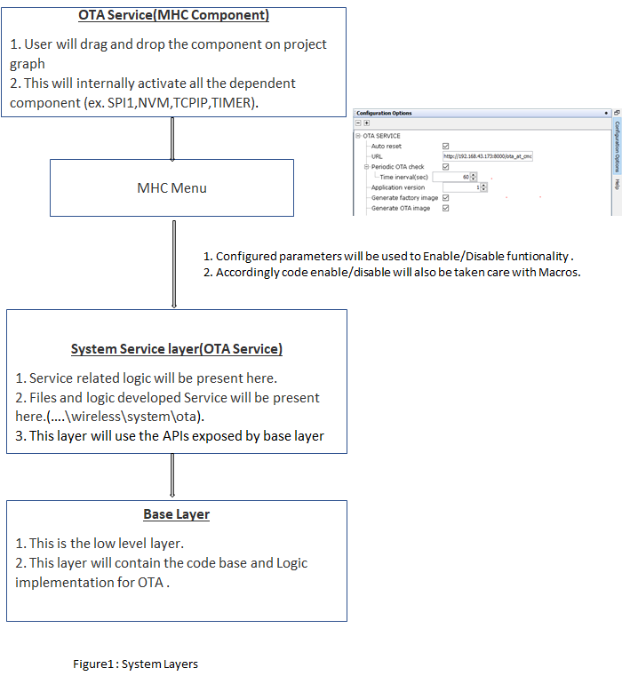
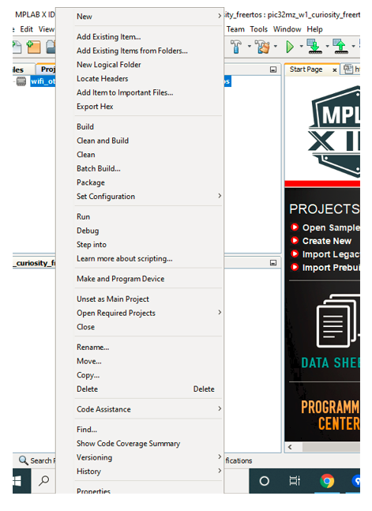

# OTA System Service Usage

**Parent topic:**[Over The Air \(OTA\) firmware update System Service](GUID-AF87F0BB-E319-4436-A302-357BFA7E193E.md)

## Description

The OTA System Service provides simple APIs to enable Over the Air system firmware image upgrade. While using the service, the application does not have to handle low level states of a TCP/IP Connection, periodic update check triggers, file integrity checks etc. since the service internally takes care of that. The user also does not required extensive Security domain knowledge to establish a secured connection via the application using OTA System Service library.

The user would need to configure the Home AP credentials \(like SSID and security items\). The Wi-Fi service will use the credentials to connect to the Home AP and acquire an IP address. Once the IP address is obtained OTA service will perform OTA update process based on user configuration in MHC.


The service state-machine will try to connect with a pre-defined OTA manifest server address and download the new image when a version higher than the version being currently executed is identified. The downloaded image will be stored in the external SPI flash initially. Upon reset, the image will be transferred to the internal flash \(NVM\) by the OTA bootloader. Once the image is successfully programmed, the updated image from the server will be executed.

The OTA service has two major components:

1.The OTA service task state-machine that will be integrated into the customer application. This task is responsible for polling for an update image, downloading and verifying an image when an update is detected, and resetting the system to apply the newly downloaded image.

2.The OTA bootloader that is responsible for identifying the presence of an updated image in the external flash filesystem and transferring it to the program flash memory \(NVM\).

A `factory image` is a unified application image that contains the bootloader and the application in a single file that can be programmed into the device using an external programmer. To create a factory image, it is required to load the `ota_bootloader` project located in the `apps` folder of `wireless_apps_pic32mzw1_wfi32e01` repo into the application project. A unified hex file will be created at the end of the compilation process. Internally, this step uses the `Hexmate` tool after compiling the application project and the bootloader project independently. More details about this can be found in **OTA System Service Configuration** section of this manual.

OTA service uses the file system component from MHC \(MPLAB® Harmony Configurator\) and is configured to use an external SPI flash by default. However, this can be modified to use a different medium without major changes since the OTA service uses the file system abstraction to talk to the external storage medium.

An OTA image database is maintained by the service in the filesystem. It contains details about the downloaded images \(image name, image status,image version, digest key\), which will be used by bootloader and OTA service.


## OTA Service Framework Architecture Overview

Over the Air \(OTA\) firmware upgrade feature is designed with a two step process, Image Downloading and Image Programming process.

-   Image Downloading is processed by the OTA service.

-   Image Programming is processed by the OTA bootloader.


**OTA service** is a Harmony component which includes the system level logic implementation and uses `OTA core` APIs. This harmony component will provide some user configurable parameters, based on which service level code will be generated with the corresponding logic. Please follow `Figure-1` and `Figure-2` for better understanding of this flow.




## Abstraction model


**User Application:** This is where the customer application logic is built.

**OTA Service:** This layer includes the service level logic implementation. This is a Harmony component which provides certain user configurable parameters\(ex- Version, Periodic update check etc.\) . Based on user configuration, generated code will be activated with required functionalities.


**OTA software platform / OTA Core :** This is the platform layer that consist of the main OTA logic implementation. When OTA process is triggered , this layer will communicate with the transport layer to connect to OTA server. If new image is available , it will initiate download using transport layer. If successfully downloaded, it will store the new image into the File System .

**File System :** The architecture is designed to provide flexibility for the customer to choose the storage medium \(ex- SST26 SPI flash, SD card, USB MSD in host mode etc.\). Any medium supported by the Harmony3 file system can be used with the OTA service.

**Bootloader :** This layer consists of the logic to safely program images from the file system \(external\) into the program memory \(NVM\) of the device. At device boot, the bootloader will check if a new image is available in the external image store and transfer it to the NVM.

## OTA server JSON manifest

The OTA service expects the HTTP based OTA server to provide metadata of images available in the server in `json` format. During periodic update checks, the OTA service task will download and parse this manifest file. Each entry in the manifest file should include the following fields :

-   **`Version`** indicates the application version number. It is a integer value.

-   **`URL`** contains the image path from which the application image can be downloaded. It is a string variable.

-   **`Digest`** contain the `SHA256` digest of image to be downloaded. It is a 64 byte string variable and should not include whitespaces

-   **`EraseVer`** This ***optional*** field provides a capability to trigger an erase of an version which was downloaded earlier. Customer may want to remove an image from the image store due to various reasons, application with bug, may be one of them. It is a bool variable.

    -   If user configures this field as "true", OTA service will delete image version mentioned in "Version" field.

    -   If user configures this field as "false", OTA service will follow image downwload logic.

-   **`Patch`** This ***optional*** field provides a facility to support patch functionality. If **patch** functionality-option is enabled in the project, application will try to fetch below fields

    -   **`BaseVersion`** This is base image version against which patch will be applied. Application will check the presence of this base image version, in OTA DB, present in external flash.

    -   **`BaseVerDigest`** Base image digest must be provided by user, which will be used by application to verify correct Base image. This digest will be compared against the digest \(stored inside OTA DB\) of base version.

    -   **`PatchURL`** URL-path of patch image.

    -   **`PatchDigest`** Digest of Patch image . This is used by the application in the device to verify downloaded patch image.

    -   **`TargetDigest`** Digest of the Target image obtained after applying Patch . This is used by the application in the device to verify target image obtained after applying patch functionality.


**Sample JSON**

```json
    {
    "ota": [
            {
                "Version": 5,
                "URL": "http://192.168.0.101:8000/wifi_ota_app_upgrade_ver2.bin",
                "Digest": "aff0d6d02fabf6a8cc96f762eb71f54f3687ce7d8605dd814055c17eface0b1d",
                "EraseVer": false,
                "Patch" : [
                              {
                                "BaseVersion": 1,
                                "BaseVerDigest": "aff0d6d02fabf6a8cc96f762eb71f54f3687ce7d8605dd814055c17eface0b1d",
                                "PatchURL": "http://192.168.0.101:8000/wifi_ota_app_upgrade_patch.patch",
                                "PatchDigest": "266008c4a6150d7033e370a48621ecd44985b3d0418cdf13bbb6efa6fae43823",
                                "TargetDigest": "beac75ef53f0159cae0645c32f58a9705d237823607c6e65267ca61793dfcb08"
                              }
                          ]
            }
           ]
    }
```

OTA service will download json file from server first when OTA process is triggered, try to fetch information and proceed further as per below logic:


## Factory Image Structure

The program memory of an application that include the OTA service will be organized as shown in the image below.


### Application Header Structure \(boot control area\)

A boot control area of size 4 KB is maintained in internal flash area of device as a shared memory between the application and the bootloader. This area will contain fields as shown in figure below.


## Image download process

1.The OTA service task identifies that the server manifest includes an image with a version number numerically higher than the current version being executed in the system. Image version number is a C macro that can be defined in MHC.

2.The transport layer starts downloading the image using the link in the URL. If the URL starts with an `https://` TLS is automatically used.

3.Once the download is completed successfully, the OTA framework verifies the image by checking the SHA-256 hash, once transport layer finished receiving all data.

If download fails, system will go to `IDLE`. If `Auto Update` is enabled, user need to reset the device to initiate OTA again.

4.If image digest verification is failed, user will be notified using user registered callback.

If image digest verification is passed, OTA framework will create an entry in OTA database present in external filesystem. OTA database is maintained in `csv` format.

Each entry in the OTA database will contain following information:

**a. image name:** name of downloaded image.

**b. image status:** This will be set as **0xFE**, for newly downloaded image.

**c. version number:** Version number of image obtained from JSON manifest.

**d. image digest:** Image digest obtained from JSON manifest.

5.Once entry is made successfully, OTA framework updates `Boot-Control-header`, status field of the current application to “Disabled�? 0xF0.

User will be notified about successful OTA process via user registered callback and wait for system reset or trigger auto system reset based on MHC configuration to load new image into the program flash memory.

## Block/Flow Diagram

**a. OTA Service:**


-   **OTA Start:** OTA process can be triggered using various methods :

    Periodically : System will communicate with OTA server periodically \(configured by user\) to check if any new image is available and initiate OTA process accordingly.

    Manually : OTA can be triggerred by the application by calling an API.

    Other sources : User may configure/implement any other means of source like MQTT server to trigger OTA. This is a subset of the manual triggers.

-   **Download JSON manifest file and check for version :** JSON file will be downloaded from server first , once OTA process is initiated. JSON file will have version number along with other details. Now system will try to compare the extracted version number from JSON file with currently running application version number and decide accordingly the next step :

    -   If version number is same abort the OTA process because new image is not available.

    -   If version number is different and higher than the current application version number, then system will continue with OTA process.

-   **Patch Functionality :** If patch functionality is enabled in the application , it will try fetch relative information from JSON manifest and proceed accordingly.

-   **Initiating image Download process :** Based on user configuration system will go for image downloading or will wait for download trigger by user.

-   **Digest verify :** SHA-256 verification will be done for downloaded image.

-   **Update OTA database file system :** If digest verification is successful , OTA database will be updated in file system for new image.

-   **Storing image in the external flash and wait :** If downloaded successfully, the image will be stored in the external flash using standard FS present in Harmony. Afterwards system will perform following steps depending upon user configuration :

    -   reset automatically if Auto reset option is enabled .

    -   wait till user application triggers reset.


**b. Image Programming:**


1.During each system boot-up, bootloader checks if it needs to program any new, valid image from the external flash. Bootloader goes to program mode, if-

1.any newly downloaded image present in the external flash.2.if the already present image in the program flash is not "validated" during previous boot.

There are two conditions :

-   whether the Application Image in Program-Flash area is valid \(indicated by the STATUS field, value of 0xF8 in image boot control area of internal flash\), and

-   whether it has been confirmed that no errors were present during the previous boot \(indicated by the STATUS field of image Database in the external flash, value of 0xF8 \).

    According to bootloader logic if these two conditions are satisfied it will not go to `Program Mode` and the bootloader immediately jumps to the application image present in the program-flash area of the device.


2.If two conditions mentioned in the step 1 are not satisfied, the bootloader switches to Image Program Mode. In Image Program Mode bootloader follows Image Programming sequence, which finds the highest ranked image in Image-Store\(external flash\), erases the Program-Flash area and copies the selected image to the Program-Flash area if the image is successfully verified. As the newly downloaded image with highest version is set as the highest ranked, during the first boot time after the Image-downloading, the bootloader attempts to load the newly downloaded image at the first try.

The bootloader choses the highest ranked image to boot. The images are ranked in following order:

```
1.The downloaded , valid Image with highest version.  

2.The next valid, higher version image.  

3.The next known valid, higher version image.  

  .

  .

  .

4.Default (Golden/Factory) image.
```

3.If the image is not valid, the bootloader invalidates the image by setting “Invalidate�? `0xF0` in `STATUS` field of image in OTA database present in the external flash and restarts the Image-Programming sequence.

4.If image is verified successfully, bootloader updates `STATUS` field of boot control area in internal flash as `Unbooted (0xFC)`

## Patch functionality

OTA service provides facility of patch OTA . User can configure `PATCH` functionality using MHC menu ,for more details on configuration please follow - **OTA System Service Configuration** section. Patching is a concept using which , user can generate a binary file, that contains only the difference between the current image and base image version. For generating diff file user can download utility\(jojodiff07\) and follow instructions from [here](https://github.com/MicrochipTech/jojodiff) . Other versions of the jojodiff utility may lead to compatiblity issues and may cause failure in the OTA patch update. Therefore it is recommended to use the jojodiff07 version for creating the diff file.

User can provide required parameters for patch in JSON file \( Please follow `OTA server JSON manifest` section , for more details \) . OTA Service will follow below steps during while processing `patch functionality` :

-   Check if base version is present in OTA DB

    -   If not present, sysetm will try to download full image from server .

    -   If present, system will proceed with logic for patch functionality.

-   During patching system will at first verify downloaded patch image using SHA-256 .

-   If patch file is verified successfully , system will generate target binary image.

-   After successful generation of target image , SHA-256 verification will be done against target image .

-   If target image is verified successfully , same will be stored in OTA DB present in the external flash.

-   Finally new image will be applied by bootloader as per application logic.


## Securing OTA by verifying Images in Bootloader

Images will be verified by using image's ECDSA signature on Bootloader. For this user need to provide image's signature , generated in R-S format to `Signature` field of JSON manifest file \(Please follow `Generating Signature` section of this document\). This `Signature` will be stored by application in `ota` database present in external flash and bootlader will use the same for image verification.

We have implemented 2 configurations of OTA Bootloader to perform signature verification of images:

1.  In software using Wolfcrypt \(ota\_booloader\_wolfcrypt.x\).

2.  In Hardware using Trust Flex device \(ota\_booloader\_trustflex.x\).


For more information on ota bootloader, please follow [Bootloader document](https://github.com/Microchip-MPLAB-Harmony/wireless_apps_pic32mzw1_wfi32e01/tree/v3.6.1/apps/ota_bootloader)

User need to load the corresponding bootloader configuration as `loadable` component as per application requirement. Loading bootloader into application is required , only for generating `factory` image. For more information on configuring `loadable project` , please refer `OTA System Service Configuration` section of [Configuring the library](configuration.md#configuring-the-library).

Whenever, user wants to apply successfully downloaded new `ota` image, bootloader will take the control. Bootloader will perform signature verification of the image :

1.  if signature verfication is failed;

    -   Bootloader will try to load another version of OTA image if present in OTA database.

    -   If bootloader can not find another image , it will load the factory image to the internal flash.

2.  if signature verification is passed; bootloader will load the image after successfully verifying digest.


**NOTE : Secure OTA is not supported, when `PATCH` functionality is enabled.**

## Enabling Secure OTA

By default, `secure ota` option will be disabled. To enable it , user need to follow below steps.

1.  Enable `Secure OTA Functionality` as described in `configure Advances Configuration` section of [Configuring the library](configuration.md#configuring-the-library).

2.  Define "SYS\_OTA\_SECURE\_BOOT\_ENABLED" in bootloader project. For more details please follow [Bootloader document](https://github.com/Microchip-MPLAB-Harmony/wireless_apps_pic32mzw1_wfi32e01/tree/v3.6.1/apps/ota_bootloader).


## Verification of factory image

For verification of factory image user need to follow below steps :

1.  User need to create ".bin" format of HEX image, created while building factory image using MPLABX . User need to use following command:

    `python hex2bin.py -i "path of hex image" -o "path of bin file" -f 0`

    `example : python hex2bin.py -i "E:\ota_new_festeure\factory_image_verification\hex2bin\factory_image.hex" -o "E:\ota_new_festeure\factory_image_verification\hex2bin\factory_image1.bin" -f 0`

    `hex2bin.py` file can be found in the `tools` folder of your project. This folder will be created when you generate MHC code with the OTA service included in your project.

2.  Generate signature, by followinf `Generating Signature` section of this document .

3.  Store the generated signature in target system using following console command \(Factory image should already be loaded in the system and factory image should be running\):

    `sysota set factory sign "signature"`

    `example : sysota set factory sign "FkV6dJ9kMqJrJypp/0/V8MdIV4Y6ocNX5NVb5zvwDa2ygXJsVHDQZGCNR/L0lp13xroX9biwMBbpi/ZqJi1Erw=="`


**NOTE :**

**1. It is recommended to perform above mentioned steps and store signature in target device as soon as application runs for the first time. This will ensure safe and successful loading of `factory image` in the system , whenever required. This is one time activity****2. If `factory reset` is triggered without storing signature of `factory image`, system will unable to load image and run.**

## Generating Public Key and Private Key

To generate private key :<br />`openssl ecparam -genkey -name prime256v1 -noout -out ECC_prime256v1.key`

To extract public key from certificate :<br />`openssl.exe ec -in ECC_prime256v1.key -pubout -out ECC_prime256v1.pub`

## Generating Signature

User need to generate signature in R-S format and provide it in manifest file. To generate R-S format of `image signature`, user may take any approach; example: using openssl library etc.

Alternately, user may use python script `ecdsaSign.py` present in the `tools` folder of project. This folder will be created when user generates MHC code with the OTA service included in project.

User may use below command, for generating signature :

`python ecdsaSign.py -f [image file name] -k [private key file name]`

Example : `python sign.py -f image.bin -k ECC_prime256v1.key`

image.bin -\> image file name.

ECC\_prime256v1.key -\> private key file name.

## Providing Signature in Manifest file:

User need to mention `Signature` in Manifest file, by introducing `Signature` field in the file as shown below:

```json
{
    "ota": [
            {
                "Version": 2,
                "URL": "http://192.168.43.173:8000/wifi_ota_app_upgrade_ver2.bin",
                "Digest": "d6f951e9ad5af844068a3ce1cc25e86ac945fa371791ca3e493f91672d95a2d4",
                "Signature": "pra2wlOiZO/zjzqaP9DZGe9dmm0aC4gx4r0yoyI7DU3sVpkdJ034v5XoiN5jdpeuLRge4RjsB/KSrVho8pwC2w==",
                "EraseVer": false
            }
           ]
}

```

## Provisioning TrustFlex parts for OTA FW Verification

ATECC608 based Trustflex can be used to perform secure firmware verification. The steps to provision it using TPDS2 is documented here.

1.  Setup TPDS V2

    Setup TPDSV2 following the steps at https://www.microchip.com/en-us/product/SW-TPDSV2

    Make sure that you update TPDS after installation.

2.  Hardware Setup

    -   Plug in the DT100104 click board into the microbus interface.

    -   Make sure that you flip all DIP switches other than SW1:2 in click board to OFF position. This will configure the board to expose the TrustFlex device over the I2C Bus.

        

3.  Device Firmware

    TPDS talks to the trust elements using the KitProtocol. So, before using TPDS to provision TrustFlex with the Rio2 device , we need to flash the [KitProtocol firmware](https://github.com/MicrochipTech/PIC32MZW1_Projects/tree/main/pic32mzw1_kitprotocol) into the dev-board.

    -   To update the kit-protocol firmware to use I2C1 instead of the default I2C2 \(connected to the onboard TnG module\), change HAL\_I2C\_I2C2 defined in hal\_i2c\_harmony.h file of the kit protocol project to HAL\_I2C\_I2C1.

    -   When the firmware boots-up, the UART console \(15008N1\) will display the devices detected.

        

        

4.  Loading the Public Key for FW verification \(Provisioning\)

    -   Open TPDS and select ATECC608-TFXTLS configurator under the "Configurators" Tab.

        

    -   Select the Firmware Validation \(Secure Boot\) usecase from the next screen

        

    -   Load the public key into Slot 15

        

    -   Generate a provisioning package and use it to provision the sample.

        -   The attached kit with the trustFlex device mounted on it will be automatically detected and provisioned.<br />

    

5.  You can now use the device to verify image signatures in the bootloader.


## Configuration fuses

Due to the way configuration fuses are stored in the device, they cannot be modified by the bootloader at runtime. Consequently, when the bootloader loads the application, the config fuses set in the bootloader \(using `#pragma` in the bootloader code\) will be retained.

Unlike most of the other PIC32MZ devices, some of the configuration values of PCI32MZW1 / WFI32 can be overridden at runtime. These are marked as loadable configurations in the datasheet. Please refer to the `Configuration Bits` section of the `SPECIAL FEATURES` chapter of the PIC32MZW1 datasheet to see a list of loadable configurations and how to apply them. These loadable configs can be applied at runtime from the application.

## Generating the OTA image

Images that are downloaded from the server as part of the OTA process should be stored in `.bin` format as opposed to the Intel Hex format that is generated by MPLABX.

To convert the `hex` file to `bin` format, you can use the `hex2bin` tool in the `tools` folder of your project. This folder will be created when you generate MHC code with the OTA service included in your project.

-   In case of a windows machine, you can execute the command `hex2bin.exe -i <path to hex file in the dist folder>`. In case your development environment is based on a non-Windows OS, you can execute the python script with the same arguments. Make sure that you have python3 installed in your machine.

-   User may execute `hex2bin` tool directly from `tools` folder without any argument. In that case, tool will search for `hex` file in default path `"..\project.X\dist\project\production"` and generate `bin` file .

-   User may also execute post build command `../../tools/hex2bin/hex2bin.exe` from MPLABx project itself :

    -   Right click on the project and click on properties.




-   Select "building", insert below command and click "OK":

    `../../tools/hex2bin/hex2bin.exe`

    **Note**: python should be present in the system variable path.

    


## OTA server

Any standard http/https server can be used as OTA server as long as it hosts a manifest file with the mandatory fields.

-   For testing the service, you may also use a simple python command to create a local **HTTP** server using below steps:

    -   Open command prompt and change directory to the folder where json file/ota image is present.

        

    -   Use below python command in command prompt:

    ```python
      python -m SimpleHTTPServer 8000
    ```

    


## Integrating bootloader

It is required to integrate the bootloader and OTA application image to create a single unified HEX file. To integrate 2 images we can use hexmate tool, which is readily available with MPLABX package as part of the standard installation. To combine the hex files - please follow steps mentioned in configuration page **OTA System Service Configuration**.

## Resolving `Data Conflict` Compilation error

During compilation if user is facing `Data conflict at address..` compilation error , please check if there is any mismatch of configuration \( `#pragma`\) between bootloader and application. User may simply compare `initialization.c` files of both the projects to check mismatch.


