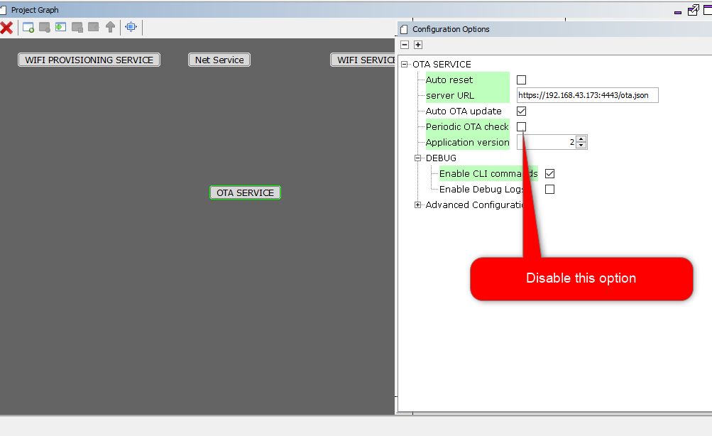

# OTA System Service Developer's Guide


## **OTA Service Architecture Overview**

Over the Air (OTA) firmware upgrade feature is designed with a two step process, Image Downloading and Image Programming process. 

1. Image Downloading is processed by the OTA service that is integrated with your application code.
1. Image Programming is processed by the OTA bootloader.

For detailed information about OTA service architecture, please refer to the `Architecture Overview` section in [Using the library](usage.md/#using-the-library) of the OTA documentation. 

## **Code modification/implementation guide for common use cases**

### **Registering a user defined callback for OTA system service**

Developer may register a callback function to receive callback from the OTA system service for pre-defined scenarios.

For registering callback developer may follow any one of below mentioned methods.

a. Using the built-in function `ota_app_reg_cb()` wrapper, defined in `app_ota.c` . Please see the code snippet below for reference:

```C
     /* Check the application's current state. */
    switch ( appData.state )
    {
        /* Application's initial state. */
        case APP_STATE_INIT:
        {
            if(true == ota_app_reg_cb())
                appData.state = APP_STATE_SERVICE_TASKS;

            appData.state = APP_STATE_SERVICE_TASKS;
            break;
        }
        case APP_STATE_SERVICE_TASKS:
        {
            break;
        }
        /* TODO: implement your application state machine.*/
        default:
        {
            /* TODO: Handle error in application's state machine. */
            break;
        }
    }
```   

The template of a callback handler function, `sys_ota_cb()` is implemented in `app_ota.c` with all the potential events from the OTA system service. Developer can modify this template to build their own custom logic as per system/application requirements.

```c
    void sys_ota_cb(uint32_t event, void * data, void *cookie) {
    switch (event) {
        
        case SYS_OTA_UPDATE_CHECK_START:
        {
            /*OTA update check start . Customer can build their own custom logic */
            SYS_CONSOLE_PRINT("SYS_OTA_UPDATE_CHECK_START\r\n");
            break;
        }
        case SYS_OTA_UPDATE_CHECK_FAILED:
        {
            /*OTA update check failed . Customer can build their own custom logic */
            SYS_CONSOLE_PRINT("SYS_OTA_UPDATE_CHECK_FAILED\r\n");
            break;
        }
        case SYS_OTA_UPDATE_AVAILABLE:
        {
            /*OTA update available . Customer can build their own custom logic */
            SYS_CONSOLE_PRINT("SYS_OTA_UPDATE_AVAILABLE\r\n");
            break;
        }
        case SYS_OTA_UPDATE_NOTAVAILABLE:
        {
            /*OTA update not available. Customer can build their own custom logic*/
            SYS_CONSOLE_PRINT("SYS_OTA_UPDATE_NOTAVAILABLE\r\n");
            break;
        }
        case SYS_OTA_TRIGGER_OTA_FAILED:
        {
            /*OTA trigger failed . Customer can build their own custom logic*/
            SYS_CONSOLE_PRINT("SYS_OTA_TRIGGER_OTA_FAILED\r\n");
            break;
        }
        case SYS_OTA_FACTORY_RESET_SUCCESS:
        {
            /*OTA Factory reset success . Customer can build their own custom logic*/
            SYS_CONSOLE_PRINT("SYS_OTA_FACTORY_RESET_SUCCESS\r\n");
            break;
        }
        case SYS_OTA_FACTORY_RESET_FAILED:
        {
            /*OTA Factory reset failed . Customer can build their own custom logic*/
            SYS_CONSOLE_PRINT("SYS_OTA_FACTORY_RESET_FAILED\r\n");
            break;
        }
        case SYS_OTA_ROLLBACK_SUCCESS:
        {
            /*OTA rollback success . Customer can build their own custom logic*/
            SYS_CONSOLE_PRINT("SYS_OTA_ROLLBACK_SUCCESS\r\n");
            break;
        }
        case SYS_OTA_ROLLBACK_FAILED:
        {
            /*OTA rollback failed . Customer can build their own custom logic*/
            SYS_CONSOLE_PRINT("SYS_OTA_ROLLBACK_FAILED\r\n");
            break;
        }
        case SYS_OTA_DOWNLOAD_START:
        {
            /*OTA image download start . Customer can build their own custom logic*/
            SYS_CONSOLE_PRINT("SYS_OTA_DOWNLOAD_START\r\n");
            break;
        }
        case SYS_OTA_DOWNLOAD_SUCCESS:
        {
            /*OTA image download success . Customer can build their own custom logic*/
            SYS_CONSOLE_PRINT("SYS_OTA_DOWNLOAD_SUCCESS\r\n");
            break;
        }
        case SYS_OTA_DOWNLOAD_FAILED:
        {
            /*OTA image download failed . Customer can build their own custom logic*/
            SYS_CONSOLE_PRINT("SYS_OTA_DOWNLOAD_FAILED\r\n");
            break;
        }
        case SYS_OTA_IMAGE_DIGEST_VERIFY_START:
        {
            /*OTA image digest verify start . Customer can build their own custom logic*/
            SYS_CONSOLE_PRINT("SYS_OTA_IMAGE_DIGEST_VERIFY_START\r\n");
            break;
        }
        case SYS_OTA_IMAGE_DIGEST_VERIFY_SUCCESS:
        {
            /*OTA image digest verify success . Customer can build their own custom logic*/
            SYS_CONSOLE_PRINT("SYS_OTA_IMAGE_DIGEST_VERIFY_SUCCESS\r\n");
            break;
        }
        case SYS_OTA_IMAGE_DIGEST_VERIFY_FAILED:
        {
            /*OTA image digest verify failed . Customer can build their own custom logic*/
            SYS_CONSOLE_PRINT("SYS_OTA_IMAGE_VERIFICATION_FAILED\r\n");
            break;
        }
        case SYS_OTA_DB_ENTRY_SUCCESS:
        {
            /*OTA database entry successful . Customer can build their own custom logic*/
            /*For Manual reset, user must trigger system reset, after system reach this state only*/
            /*Do not use API call from here. Use variables to get the status*/
            SYS_CONSOLE_PRINT("SYS_OTA_DB_ENTRY_SUCCESS\r\n");
            ota_complete = true;
            break;
        }
        case SYS_OTA_IMAGE_ERASE_FAILED:
        {
            /*OTA image erase failed . Customer can build their own custom logic*/
            SYS_CONSOLE_PRINT("SYS_OTA_IMAGE_ERASE_FAILED\r\n");
            break;
        }
        case SYS_OTA_IMAGE_ERASED:
        {
            /*OTA image erase success . Customer can build their own custom logic*/
            SYS_CONSOLE_PRINT("SYS_OTA_IMAGE_ERASED\r\n");
            break;
        }
        case SYS_OTA_IMAGE_DATABASE_FULL:
        {
            /*OTA image database full . Customer can build their own custom logic*/
            SYS_CONSOLE_PRINT("SYS_OTA_IMAGE_DATABASE_FULL\r\n");
            break;
        }
        default:
        {
            /*unknown state*/
            break;
        }
    }
```

b. Alternately developers may use `SYS_OTA_CtrlMsg()` API to register their own callback function. Please follow below code snippet for reference :

  ```c
     if (SYS_OTA_SUCCESS == SYS_OTA_CtrlMsg(SYS_OTA_REGCALLBACK, sys_ota_cb, sizeof (uint8_t *)))
     {
        /*Callback register request success*/
     } 
     else 
     {
        /*Callback register request fail*/
     }

  ```  

### **_Check_ for updates on a custom trigger trigger :**

Your system design may have requirements to check, update image availability, in OTA server only during specific particular conditions  (e.g : Switch pressed or when a MQTT message received on a specific topic). System should then initiate an OTA check in the image server.
 
Under such condition to initiate update check on user trigger , user may follow below steps:

1. Disable `Periodic OTA check` option, in MHC configuration.
   

2. Generate code.

3.  Modify application code to initiate update check using control API `SYS_OTA_CtrlMsg(uint32_t event, void *buffer, uint32_t length) `, when trigger condition is fulfilled (e.g. when a switch is pressed ).

    ```c
    if(SWITCH1_Get() == SWITCH1_STATE_PRESSED )
    {          
        SYS_OTA_CtrlMsg(SYS_OTA_UPDATECHCK,NULL,NULL);
    }
    ```

### **Initiate OTA on user trigger :**

System design may have requirements to trigger an OTA _update_ only once a condition only is met. (e.g : Switch pressed or when a MQTT message received from MQTT server).

Under such condition to trigger OTA manually, user may follow below steps:
1. Disable `Auto OTA update` and `Periodic OTA check` options, in MHC configuration.

   

2. Generate code.

3. Developer should provide server URL, OTA image version number present in OTA server and digest of OTA image using API `SYS_OTA_SET_PARAMETERS(char *url, uint8_t version, char *digest)` 

    1. The parameters should be sent to the device out of band. E.g: The payload of an MQTT message.
    2. It would be user responsibility to provide correct image version number, as OTA service will not be doing any verion check of ota image. It will simply download the image from user defined server and store the parameter details as provided into OTA database.

4. Modify application code to trigger OTA using control API `SYS_OTA_CtrlMsg(uint32_t event, void *buffer, uint32_t length) `, when trigger condition is fulfilled (e.g. when a switch is pressed ).


    ```c
    /* Check the application's current state. */
    switch ( appData.state )
    {
        /* Application's initial state. */
        case APP_STATE_INIT:
        {
            if(ota_app_reg_cb() == true)
            {
                uint8_t version = 2;
                char *digest = "ef90bf8bf7fd96205c3240c31e1a378430e7a8f053a300e5c91ebe64fefea197";
                SYS_OTA_SET_PARAMETERS("http://192.168.43.173:8000/wifi_ota_demo.bin", version , digest);
                appData.state = APP_STATE_SERVICE_TASKS;
            }
            break;
        }
        case APP_STATE_SERVICE_TASKS:
        {
            if((SWITCH1_Get() == SWITCH1_STATE_PRESSED) && (ota_initiated == false))
            {          
                ota_initiated = true;
                if(SYS_OTA_SUCCESS == SYS_OTA_CtrlMsg(SYS_OTA_INITIATE_OTA,NULL,NULL))
                    appData.state = APP_STATE_OTA_INITIATE_SUCCESS;
                else   
                    ota_initiated = false;
            }
            break;
        }
        case APP_STATE_OTA_INITIATE_SUCCESS:
        {
            break;
        }
        /* TODO: implement your application state machine.*/
        default:
        {
            /* TODO: Handle error in application's state machine. */
            break;
        }
    }
  ```

### **Initiate Factory Reset on user trigger :**

Factory Reset is a functionality using which user may get the system back to its original state, meaning, the Factory image will be programmed to internal flash (Program memory) and all other OTA images will be erased from external flash storage along with OTA database if it exist.

User may initiate Factory reset using the `SYS_OTA_TRIGGER_FACTORY_RESET` control message as shown in the code snippet below.

```c
    if(SWITCH1_Get() == SWITCH1_STATE_PRESSED )
    {          
      SYS_OTA_CtrlMsg(SYS_OTA_TRIGGER_FACTORY_RESET,NULL,NULL);
    }
```


### **How to trigger system reset (from application) on successful OTA completion, with `Autoreset` option disabled in MHC :**

Developer may choose to disable `Autoreset` option in MHC and may have requirement to build custom logic for application, deciding when to go for system reset after successful OTA download. This will enable the system/application to complete important tasks before triggering a system reset.

Developer may easily develop such custom logic using `SYS_OTA_CtrlMsg()` API for system reset.

Please follow below code snippet for reference :

```c
if (SYS_OTA_SUCCESS == SYS_OTA_CtrlMsg(SYS_OTA_TRIGGER_SYSTEM_RESET, NULL, NULL))
     {
        /*System reset request success.*/
     } 
     else 
     {
        /*System reset request fail*/
     }
```

Please note that `SYS_OTA_CtrlMsg()` will return `SYS_OTA_SUCCESS`, if the request is successful. System will reset only if OTA download has completed successfully. User can check for `SYS_OTA_DB_ENTRY_SUCCESS` system callback state, to trigger manual reset.  

### **How to limit `periodic OTA check` for a definite number of times :**

Developer may have requirement to limit `periodic OTA check` to a definite number of times.

For example, OTA service should go to idle state until next reset after checking update availability for `3` times consecutively. For this, developer may add below lines of code in `sys_ota.c` file: 

```c
   if(update_check_counter++ >= 3) // `update_check_counter` is an extern variable, defined by developer
                {
                    SYS_CONSOLE_PRINT("Update availability check completed for 3 times, no update found\n\r");
                    sys_otaData.state = SYS_OTA_IDLE;
                    break;
                }
```


### **What will happen if an image is downloaded successfully but image digest verify fails :**

With default logic, the downloaded image will be erased if digest verify fails. OTA system service will disable auto update check, provide user callback and go to IDLE mode.

### **How developer can trigger periodic update check , when a user defined condition is satisfied (e.g. : switch pressed) :** 

Developer may have the requirement to trigger periodic update check, only when a user defined condition is satisfied .

Let us assume a scenario , in which application should trigger periodic update check, when user press a switch. To develop this particular requirement user may follow below steps :

1. Disable `Periodic OTA Check` option in MHC.

   

2. Generate code using MHC.
3. Add below lines of code at the beginning of `case SYS_OTA_SERVER_UPDATE_CHECK` in `sys_ota.c` file.
   
    ```c
    g_SysOtaConfig.ota_periodic_check = true;
    sys_otaData.state = SYS_OTA_AUTO_CONFIGURATION_CHECK;
    break;
    ``` 

   

 4. Write custom logic in application file "app.c".

    ```c
    if((SWITCH1_Get() == SWITCH1_STATE_PRESSED) && (ota_initiated == false))
            {          
                ota_initiated = true;
                if(SYS_OTA_SUCCESS == SYS_OTA_CtrlMsg(SYS_OTA_UPDATECHCK,NULL,0))
                    appData.state = APP_STATE_OTA_INITIATE_SUCCESS;
                else   
                    ota_initiated = false;
            }
    ```

 ### **How to get download status during OTA update :**

 Application Developer may want to get the download status during OTA update, for certain application logic development. 
 They may easily extract download status using below lines of code :

 ```c
    {
        OTA_GetDownloadStatus(&ota_params);//ota_params should be defined as : OTA_PARAMS ota_params;
        SYS_CONSOLE_PRINT("*******************************************\n\r");
        
        SYS_CONSOLE_PRINT("Total data to download : %d bytes\n\r", ota_params.server_image_length);
        SYS_CONSOLE_PRINT("Data downloaded : %d bytes \r\n", ota_params.total_data_downloaded);
        SYS_CONSOLE_PRINT("*******************************************\n\r");
    }
 ```