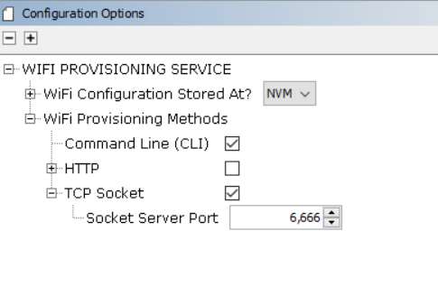
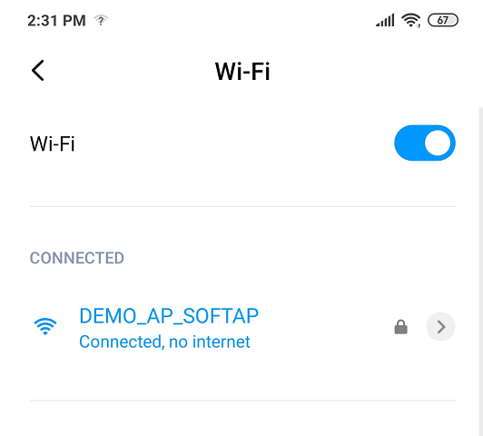
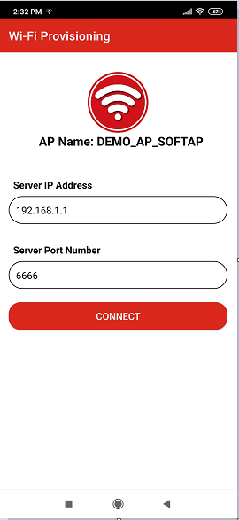
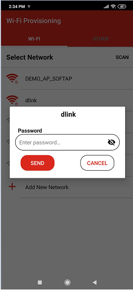
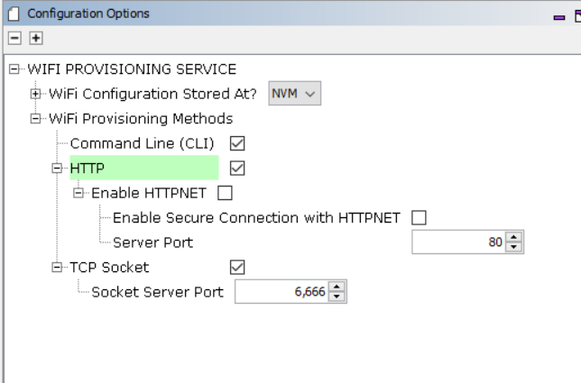
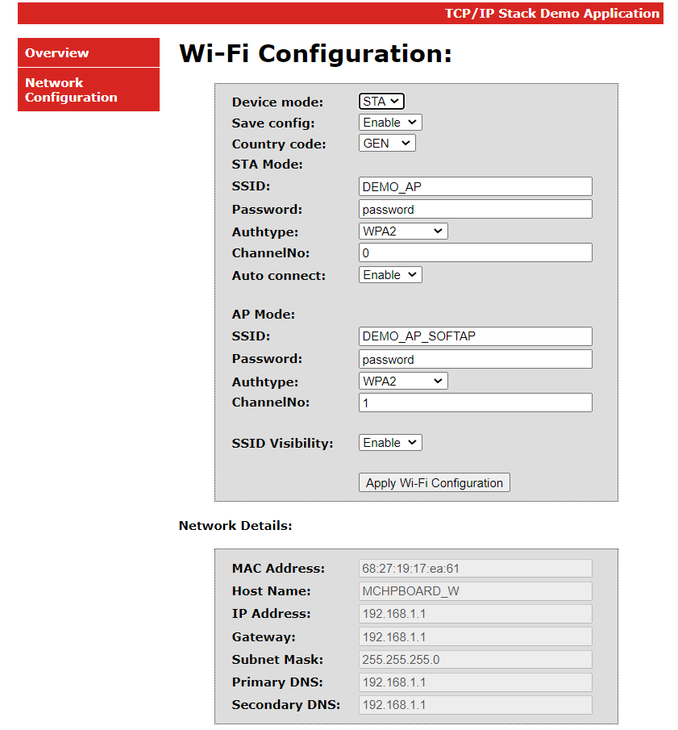
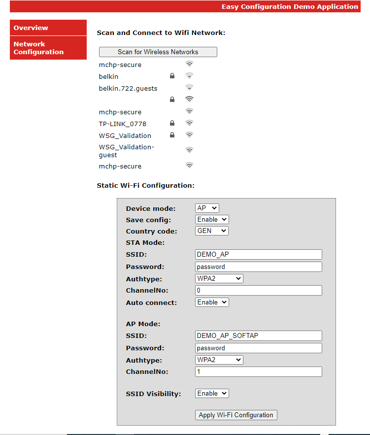
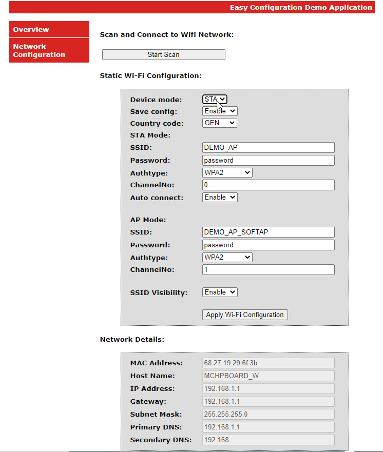
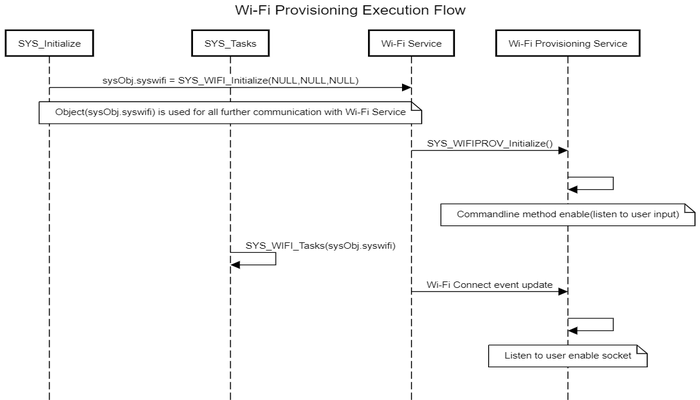

\# Wi-Fi provisioning System Service Usage

The Wi-Fi Provisioning System Service povides below methods to configuring desired Wi-Fi SSID and related security credentials of the Home AP into the device.

# Wi-Fi Provisioning Methods

**Parent topic:**[Wi-Fi provisioning System Service](GUID-6C1BB28E-7F9B-4582-8E74-E301F89C58AC.md)

## Command line

MHC configuration menu for Command line\(CLI\):



-   Enable Check box "Command Line\(CLI\)" to include CLI Wi-Fi provisioning method.

-   After making configuration changes, generate the code.

-   Compile the project and load the image into device.


Wi-Fi Provisioning commands Details

|Command|Details|Example|
|-------|-------|-------|
|wifiprovhelp|Wi-Fi Provision System Service help command|wifiprovhelp|
|wifiprov set <bootmode\> <save config\> <country code\> <channel\> <auto\_connect\> <authtype\> <ssid\_name\> <psk\_name\>|Set Wi-Fi Configuration for Station\(STA\) mode|wifiprov set 0 1 "GEN" 0 1 3 "DEMO\_AP" "password"|
|wifiprowifiprov set <bootmode\> <save config\> <country code\> <channel\> <ssid\_visibility\> <authtype\> <ssid\_name\> <psk\_name\>|Set Wi-Fi Configuration for Access point\(AP\) mode|wifiprov set 1 1 "GEN" 1 1 3 "DEMO\_SOFTAP" "password"|
|wifiprov get|Get Wi-Fi Configuration|wifiprov get|
| | | |

Wi-Fi Provisioning commands command parameters information,

|Parameter|Sub Parameter|
|---------|-------------|
|bootmode|0 - Station\(STA\) mode.1- Access point\(AP\) mode.|
|save config|0 - Do not save configuration in NVM\(Program Flash Memory\). 1- Save configuration in NVM .|
|country code|country code configuration: GEN - General USA - North America EMEA - Europe CUST1,CUST2 - Customer custom regulatory configuration|
|Channel|In Station mode value range from 0-13, 0 - select all the channels.1-13 - select specified channel. In Access point mode value range from 1-13.|
|auto connect\(only applicable in STA mode\)|0 - Don't connect to AP, wait for client request.1 - Connect to AP.|
|ssid visibility \(only applicable in AP mode\)|0 - Hidden SSID.1 - Broadcast SSID .|
|authtype\(Security type\)|1 - OPEN Mode. 3 - WPAWPA2 \(Mixed\) mode. 4 - WPA2 mode. 5 - WPA2WPA3 \(Mixed\) mode. 6 - WPA3 mode.|
|ssid\(ssid name\)|SSID name|
|psk name\(password\)|Password/passphrase|
| | |

Note:

-   Wi-Fi Provisioning using command line method is not recommended in production release due to security concerns.

-   All commands the parameters are mandatory, and none are optional except for password in case of "open" authentication.


## TCP Socket mode

MHC configuration menu for TCP Socket:


-   Enable Check box "TCP Socket" to include TCP Socket Wi-Fi provisioning method.

-   Modifiy the "Socket Server Port".Defult port number is 6666.

-   After making configuration changes, generate the code.

-   Compile the project and load the image into device.


Wi-Fi provisioning service can be configured to use TCP socket, a socket server is activated when the device boots.Use a laptop or mobile phone as a TCP client to connect to the device's socket server. Wi-Fi provisioning service defult TCP server port is 6666.

### Wi-Fi provisioning with JSON format

User can send the below JSON format data from TCP Client to provisioning the device.

Example:

```json
{ 
"mode": 0, "save_config": 1,"countrycode":"GEN", 
"STA": { "ch": 0, "auto": 1, "auth": 3, "SSID": "DEMO_AP", "PWD":"password"}, 
"AP": {"ch": 2, "ssidv": 1, "auth": 4, "SSID": "DEMO_AP_SOFTAP", "PWD": "password" } } 
```

Details of JSON Parameters,

|Parameter|Sub Parameter|Value Details|
|---------|-------------|-------------|
|mode||0 - Station\(STA\) mode. 1- Access point\(AP\) mode.|
|save\_config||0 - Do not save configuration in NVM. 1- Save configuration in NVM .|
|STA|ch \(Channel\)|In Station mode value range from 0-13,0 - select all the channels.1-13 - select specified channel.|
||auto\(auto connect\)|0 - Don't connect to AP, wait for client request. 1 - Connect to AP.|
||Auth\(Security type\)|1 - OPEN Mode.3 - WPAWPA2 \(Mixed\) mode. 4 - WPA2 mode. 5 - WPA3 mode.|
||SSID\(ssid name\)|SSID name|
||PWD\(password\)|Password/passphrase|
|AP|ch \(Channel\)|In Access point mode value range from 1-13|
||ssidv\(ssid visibility\)|0 - Hidden SSID. 1 - Broadcast SSID .|
||Auth\(Security type\)|1 - OPEN Mode. 3 - WPAWPA2 \(Mixed\) mode. 4 - WPA2 mode. 5 - WPA2WPA3 \(Mixed\) mode. 6 - WPA3 mode.|
||SSID\(ssid name\)|SSID name|
||PWD\(password\)|Password/passphrase|
| | | |

### Wi-Fi provisioning with Mobile Application

Follow below steps to provisioning the device using mobile application:

-   Download and install the mobile application "Wi-Fi Provisioning" from Android play store.

-   Start PIC32MZW1 device in AP mode \(Configure Wi-Fi Service "Device Mode" as "AP"\).

-   Using mobile Wi-Fi setting, make a Wi-Fi connection to PIC32MZW1 AP Mode.




-   Open the "Wi-Fi Provisioning" application.

-   Enter PIC32MZW1 IP address as Server IP in the mobile application.

-   Enter the Wi-Fi provisioning System Service configured port number.




-   SCAN near by HOMEAP and select the desired HOMEAP.

-   Enter the password.




-   User can manually add provisioning information using "Add New Network" option also.


-   After provisioning the device reboot and connect to HOMEAP.


Sending the TCP data without mobile application: Using laptop or mobile phone as TCP client,user can send the TCP data in below format to provisioning the device.

TCP Data Format : apply,<ssid\>,<Auth\>,<password\>,NULL

|Parameter|Details|
|---------|-------|
|ssid\(ssid name\)|SSID name|
|Auth \(security type\)|1- OPEN MODE 2 - WPA2 Mode|
|psk name\(password\)|Password/passphrase|
| | |

## HTTP

### Webpage using HTTP

MHC configuration menu for HTTP \(unsecure\):



-   Enable Check box "HTTP" to include Wi-Fi provisioning using webpage.

-   press "Yes"for components inclusion pop-up.

-   When user enable "HTTP" checkbox only, defualt wi-f provising method enable with port number 80.

-   After making configuration changes, generate the code.

-   Compile the project and load the image into device.


Follow below steps to provisioning the device using HTTP:

-   Start PIC32MZW1 device in AP mode \(Configure Wi-Fi Service "Device Mode" as "AP"\).

-   Connect Laptop or mobile phone to PIC32MZW1 AP device.

-   Open the browser and enter the PIC32MZW1 AP IP address\(example: http://192.168.1.1/\).


-   Goto "Network Configuratio" page.

-   There are two ways of configuring a wifi network: "Scan and Connect to Wifi Network", and "Static Wifi Configuration".




-   In case of "Scan and Connect", one can scan \(press the 'Start Scan' button\) for the available APs in the vicinity and connect to the AP of one's choice.




-   Click on the AP from the list, you want to connect to. In case of secured AP, the user needs to give the password.


-   In case of Hidden Networks, the SSID of the AP will not be visible. In this case, the user will need to give both SSID and the password.


-   For "Static Wifi Configuration", update the Configuration details and click on "Apply Wi-Fi Configuration".




-   Device will reboot and apply configuration in the device.


HTTP functionality is also supported in station\(STA\) mode.

### Webpage using HTTPNET \(Un-Secure\)

MHC configuration menu for HTTPNET\(Unsecure\):


Follow below steps to enable to HTTPNET unsecure,

-   Enable Check box "Enable HTTPNET".

-   Configure "Server port".User can configure any valid port number.

-   Enable Check box "HTTP" and press "Yes"for components inclusion pop-up.

-   After making configuration changes, generate the code.

-   Compile the project and load the image into device.


Follow below steps to provisioning the device using HTTP:

-   Start PIC32MZW1 device in AP mode \(Configure Wi-Fi Service "Device Mode" as "AP"\).

-   Connect Laptop or mobile phone to PIC32MZW1 AP device.

-   Open the browser and enter the PIC32MZW1 AP IP address with port number\(example: http://192.168.1.1:401/\).


-   Goto "Network Configuratio" page.

-   Update the Configuration details and click on "Apply Wi-Fi Configuration"


-   Device will reboot and apply configuration in the device.


### Webpage using HTTPNET \(Secure\)

MHC configuration menu for HTTPNET\(secure\):


Follow below steps to enable HTTPNET secure,

-   Enable Check box "Enable HTTPNET".

-   Enable check box "Enable Secure Connection with HTTPNET"

-   Configure "Server port".User can configure any valid port number.

-   Enable Check box "HTTP" and press "Yes"for components inclusion pop-up.

-   After making configuration changes, generate the code.

-   Compile the project and load the image into device.


Follow below steps to provisioning the device using HTTP:

-   Start PIC32MZW1 device in AP mode \(Configure Wi-Fi Service "Device Mode" as "AP"\).

-   Connect Laptop or mobile phone to PIC32MZW1 AP device.

-   Open the browser and enter the PIC32MZW1 AP IP address with port number\(example: https://192.168.1.1:443/\).


-   Goto "Network Configuratio" page.

-   Update the Configuration details and click on "Apply Wi-Fi Configuration"


-   Device will reboot and apply configuration in the device.


# How The Library Works

The Wi-Fi Provisioning System Service implemented Command line,HTTP and Socket mode Wi-Fi Provisioning method.Wi-Fi Provisioning System Service by default enabled along Wi-Fi System Service.User can make configuration changes as per their application requirement

## Execution Flow

The following diagram shows how the Command line and Socket mode Wi-Fi Provisioning methods are enabled.



