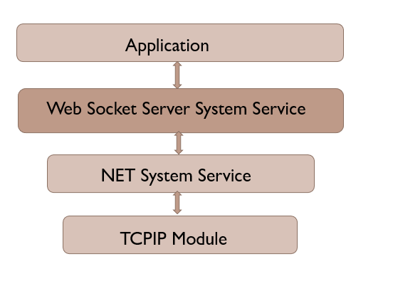
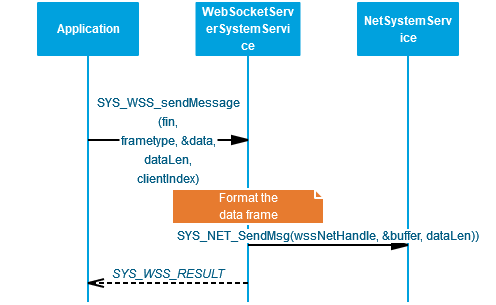

# Web Socket Server System Service Developer's Guide

The purpose of this document is to explain the Web Socket Server system service design to enable the developer to make changes in the service code as per his/ her requirements if the need be.

**Parent topic:**[Web Socket Server \(WSS\) System Service](GUID-097A4209-8474-480E-A141-6C8FC60A7671.md)

# Overview

The WSS system service provides an application programming interface \(API\) to manage the Web Socket Server functionalities over TCP/IP Networking. The WSS system service uses the MPLAB Harmony NET system service to achieve the TCPIP functionalities.

Key Features:

-   Implements the WSS protocol as a service

-   Supports multiple client connections simultaneously

# Detailed Design

WSS system service is a background service with which the application can interact using the APIs provided. The idea of the WSS system service is to reduce the code size for the application and simplifying the state machine that the application may need to maintain by abstracting out the complexity of the Web Socket Server in the system service.

## State Machine

The various states of the WSS system service are of the enum type [*SYS\_WSS\_STATE*](https://microchip-mplab-harmony.github.io/wireless_system_pic32mzw1_wfi32e01/system/wss/docs/interface.html#SYS_WSS_STATE).

The WSS system service runs a finite state machine with the following states:

1.  *SYS\_WSS\_STATE\_CLOSED* : Initial State of the WSS system service, at the initialization.

2.  *SYS\_WSS\_STATE\_CLOSING* : An intermediate state which handles the processing of the client closing handshake .

3.  *SYS\_WSS\_STATE\_CONNECTING* : An intermediate state which handles the processing of the client opening handshake.

4.  *SYS\_WSS\_STATE\_CONNECTED* : The state which handles all the data transmissions.

## Number of Clients Supported

The maximum number of Clients supported by WSS system service currently is 8. The user can change the value via the MHC. Default the value is set to 2.

## Client time out

The user can configure a timeout value which will be considered as a maximum idle time for a client connection. The default timeout value is 30s.

## API Implementation

This section describes the high level implementation details of the WSS APIs.

### SYS\_WSS\_register\_callback\(\)

The API is used for registering the application callback function with the WSS service.

### SYS\_WSS\_CloseConnection\(\)

This API is used to close the Web Socket connection to the client indicated by the parameter `clientIndex`. This will initiate the closing handshake from the server.

### SYS\_WSS\_PingClient\(\)

This API is used to send a ping message to the client indicated by the parameter clientIndex.

### SYS\_WSS\_sendMessage\(\)

This API is used to send a message to the client indicated by the parameter `clientIndex`.

### SYS\_WSS\_Initialize\(\) / SYS\_WSS\_Deinitialize\(\)

These functions are used for initializing/ deinitializing the data structures of the WSS system service.

## Code location

The base code for the WSS system service can be found in the *wireless\_system\_pic32mzw1\_wfi32e01\\system\\wss*

The same shall be copied to the following location after the code for the application is generated – *my\_application\\firmware\\src\\config\\pic32mz\_w1\_curiosity\\system\\wss*

The core includes two files:

1.  Header file: *sys\_wss.h*

2.  Source file: *src/sys\_wss.c*

The WSS component can also optinoally generate two application template files. The template file includes a callback that can be modified as required by the end user application.

1.  Header file: *app\_wss.h*

2.  Source file: *src/app\_wss.c*

> Since the above files could see modifications across releases, the users should take care of merging the changes they did in these files with the ones which were done in the new release by Microchip Team. For this the user needs to take care of this while generating the code via the MHC:

While generating the code the user should use the Merge Strategy as `USER_ALL`, and click `Generate`. In case there are changes done by user in any of the files, the MHC shall prompt the user about it:

The user can merge his changes with the the latest changes done in the services using the above window.

