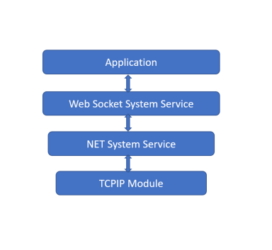
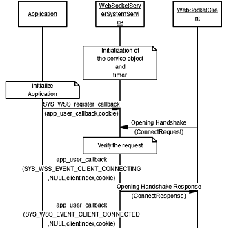
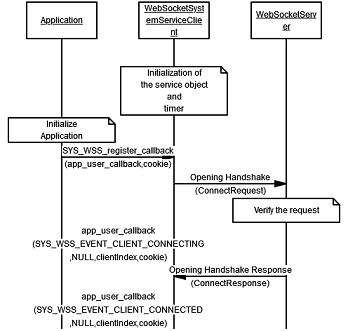
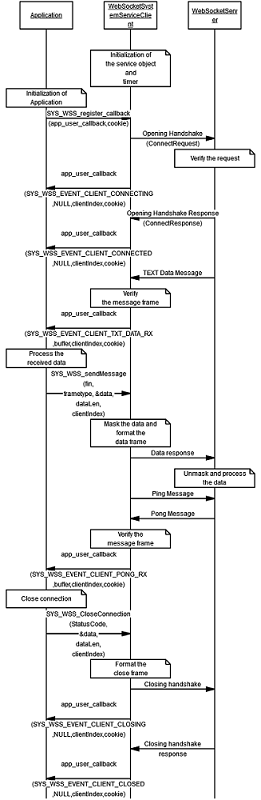

# Web Socket System Service Usage
## Description
Web Socket System Service Library provides an application programming interface (API) for implementing a Web Socket functionalities. The user need not take care about the connection handshakes,the data frame formatting etc.The WSS Service uses the underlying Net system Service APIs for achieving TCPIP network functionalities. 

## Abstraction Model
 The Web Socket System Service provides an abstraction to the complete Web Socket implementation with the following functinalities.

- Connectivity to multiple clients
- Simple APIs for data exchanges
- Reduced time for application development

The Web Socket System Service supports the below operating modes:
- Server Mode
- Client Mode

The following diagram depicts the Web Socket System Service abstraction model.

## How the service works

Once the user configures the Web Socket System Service in the MHC, the MHC will generate the required code for service implementation. User need to implement his application according to the requirement. The WSS service initialization will be taken care with the code generation.To get the indication on Web Socket Service events, user need to register the callback function using the API SYS_WSS_register_callback().

## Web Socket System Service Initialization in Sever Mode
 
 

## Web Socket System Service Initialization in Client Mode

 

## Web Socket System Service API usage in Server Mode

The below diagram shows the API usage of the Web Socket System service in Server mode.

 

 ## Web Socket System Service API usage in Client Mode

The below diagram shows the API usage of the Web Socket System service in Client mode.

 
 

