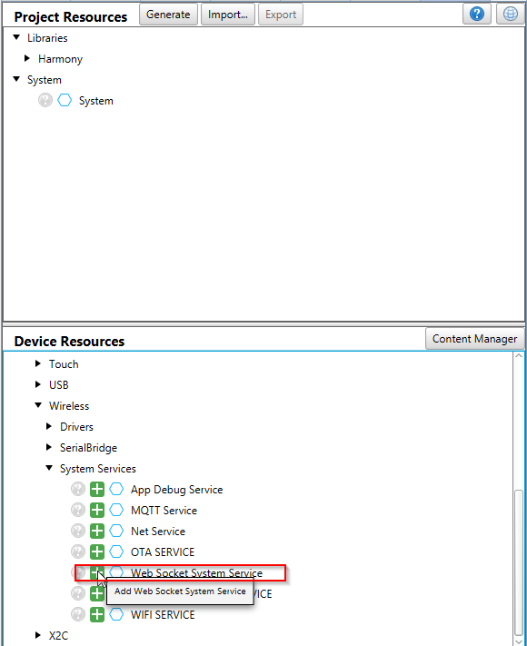
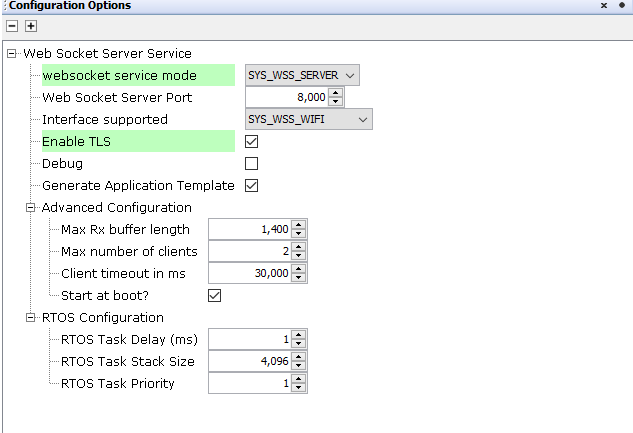
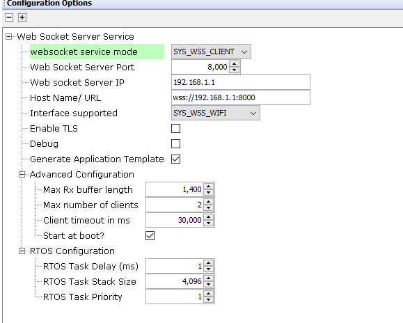
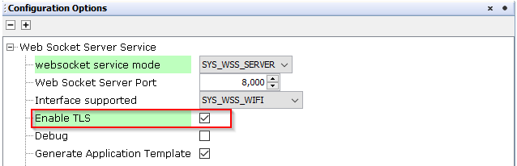
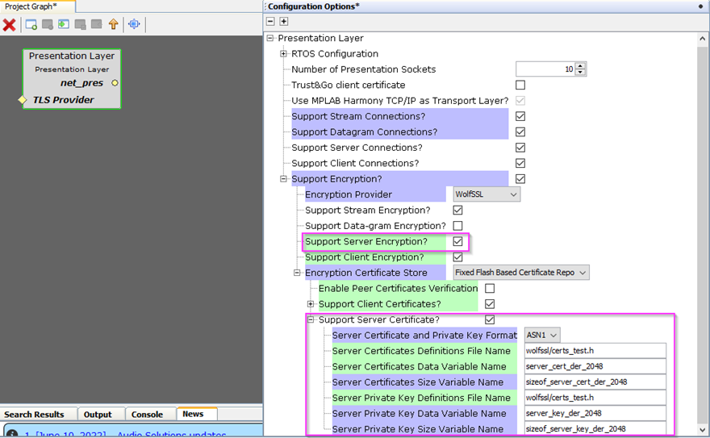
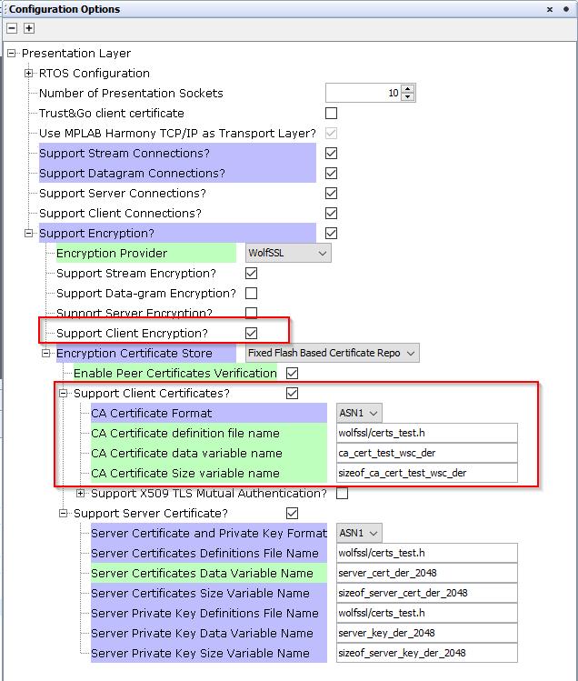

# Web Socket System(WSS) Service Configuration

The WSS System Service library should be configured through MCC. When user adds the WSS System Service into a project, all the required dependencies and components are added automatically into the the projects MCC configuration. The user can make changes according to the application requirement in the WSS System Service configuration menu.

The following figure shows the MCC configuration window for configuring the WSS System Service and a brief description of various configuration options.

1. Open the MCC 

2. Click on the "+" button to add the WSS Service Module from the Available components into the Project Graph. This will trigger the auto activation of the dependent modules.Click on 'Yes' in the confirmation window popped up for component auto activation.  

    

3. Configuring the various parameters 

    1. Server Mode  

        

    2. Client Mode

        

    |Parameter     	                    | Description   	                                |
    |---	                            |---	                                            |
    |WebSocket Service Mode   	        |WSS service mode(Client/Server).Default mode is set to server.   |
    |WebSocket Server Port              |port used by the WSS service. Default is 8000   	|
    |Interface supported                |Interface enabled for WSS service.(Wi-Fi/Ethernet) |
    |WebSocket Server IP  	            |IP address of the websocket server.Applicable only in the client mode.|
    |Host Name/URL                      |Host name/URL of websocket server.Applicable only in the client mode. |
    |Debug         	                    |Control debug prints. Disabled by default.     	    |
    |Enable TLS                         |Enable/Disable secure web socket. Make sure that you configure the required server certificate and keys in the underlying layers.|
    |Application template Generation| Control the generation of an application template with all the available callbacks.|

4. Enabling secure websocket

    To enable the secure web socket support user need to enable the below configuration options.

    1. Enable the highlighted option in the WSS Service MCC configuration.

        

    2. Enable the highlighted options in the Presentation layer net_pres component. 

        1. Server Mode : 

           The server certificate used by default will be the one provided by the wolfssl module. The user need to provide the required modifications in the highlighted parameters incase of application specific certificate and keys.
        
            

        2. Client Mode:

           The user need to provide the required certificate information in the highlighted parameters for successful TLS connections.

            

5. Advanced Configuration with RX buffer size, maximum number of supported clients, client timeout and start at boot features.  
   
    | Parameter             | Description                                                                                                          |
    |---                    |---                                                                                                                   |
    |Max Rx buffer length   | Max length of the buffer used to receive and process messages. Default is 1400                                       |
    |Max number of clients  | Max number of clients allowed to connect to the WSS(Applicable only for the server mode). Default is 2 .                                                  |
    |Client timeout in ms   | Timeout after which the client is disconnected in case of no data transfer or ping after connection. Default is 30000|
    |Start at boot          |Control when the WSS is enabled. Enabled at boot by default.                                                          |

    

6. FreeRTOS configuration enabled by default  
   
    |Parameter | Description |
    |--- |--- |
    | RTOS Task Delay(ms)  | WSS RTOS task delay. Default is 1 ms   |
    | RTOS Task Stack Size  | WSS RTOS task stack size. Default is 4096 |
    | RTOS Task priority    | WSS RTOS task priority. Default is 1|  

All of the required files are automatically genarted and added into the MPLAB X IDE project by the MCC when the code generation
completes successfully.  
