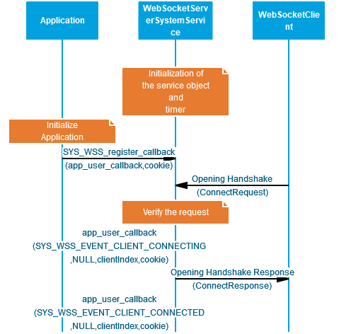
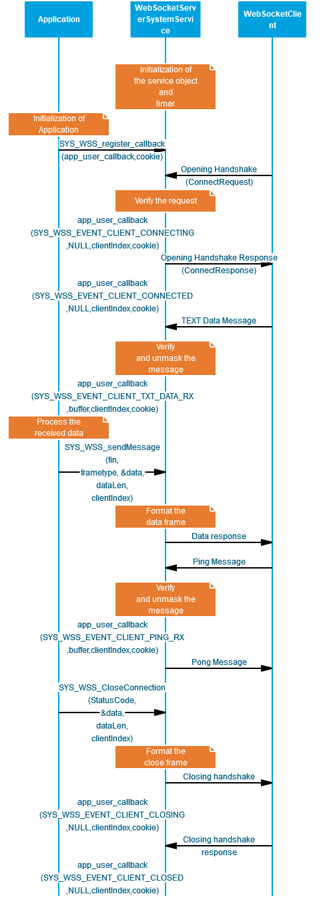

# Web Socket Server System Service Usage
## Description
Web Socket Server System Service Library provides an application programming interface (API) for implementing a Web Socket Server functionalities. The user need not take care about the frame connection handshakes,the data frame formatting etc.   The WSS System Service uses the underlying Net system  Service APIs for achieving TCPIP network functionalities. 

## Abstraction Model
The Web Socket Server System Service provides an abstraction to the complete Web Socket Server implementation with the following functinalities.

- Connectivity to multiple clients
- Simple APIs for data exchanges
- Reduced time for application development

The following diagram depicts the Web Socket Server System Service abstraction model.

## How the service works

Once the user configures the Web Socket Server System Service in the MHC, the MHC will generate the required code for service implementation. User need to implement his application according to the requirement. The WSS system service initialization will be taken care with the code generation.To get the indication on Web Socket Server events, use need to register the callback function using the API SYS_WSS_register_callback().

## Web Socket Server System Service Initialization
 
 

## Web Socket Server System Service API usage

The below diagram shows the API usage of the Web Socket Server System service.

 
 

